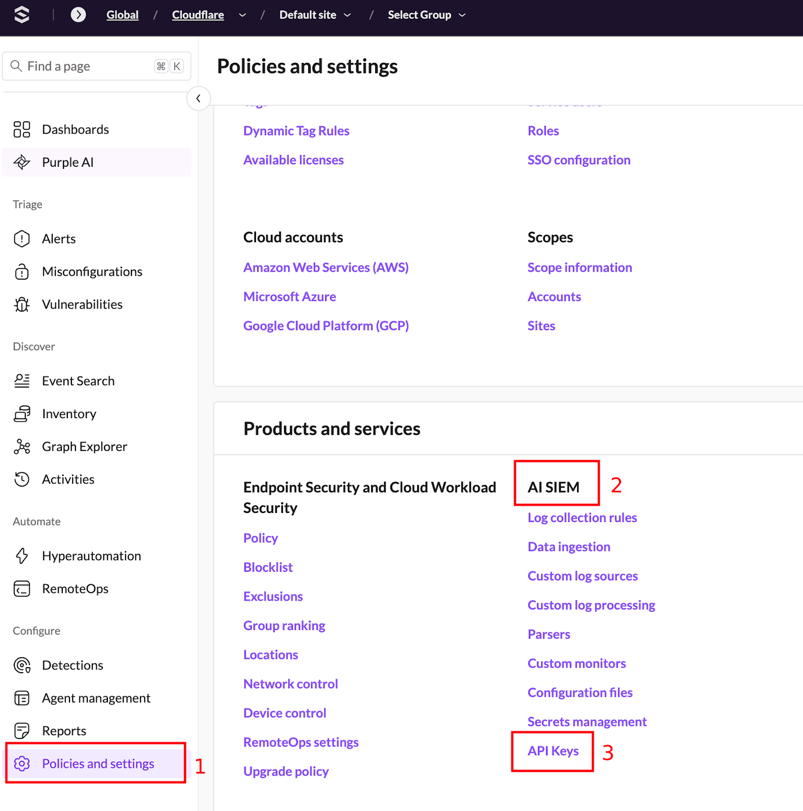
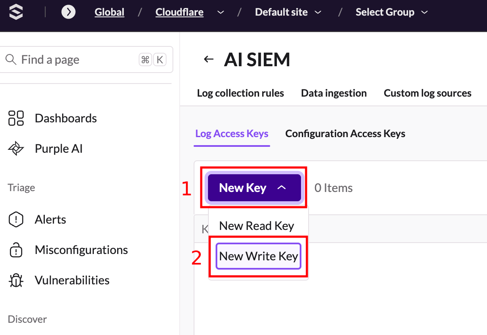
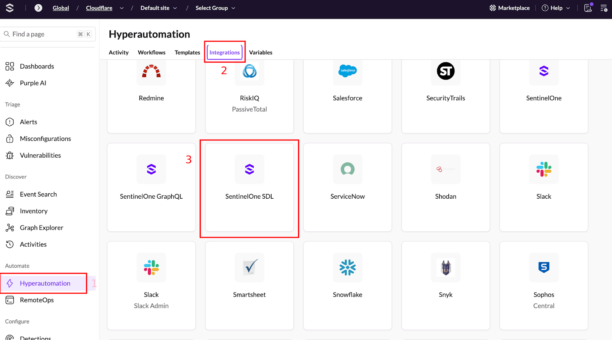
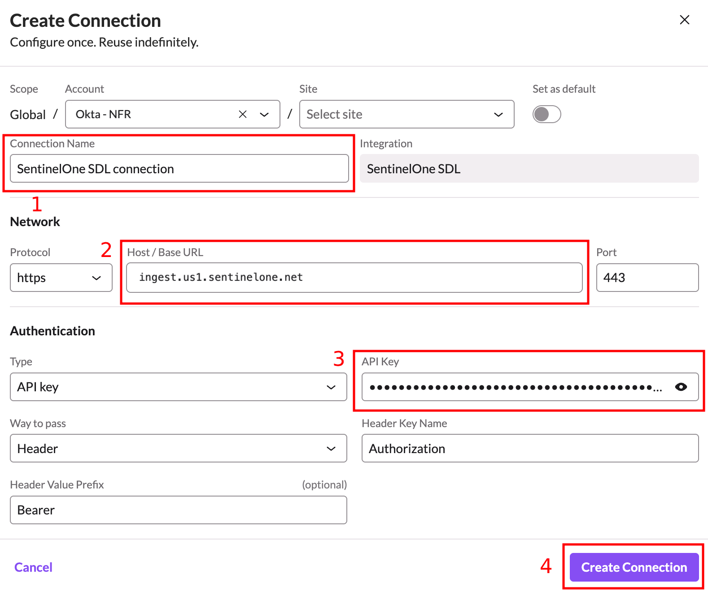
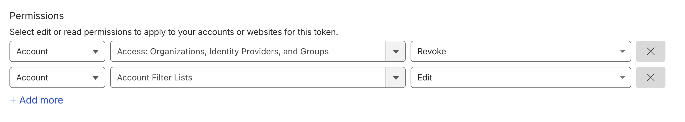
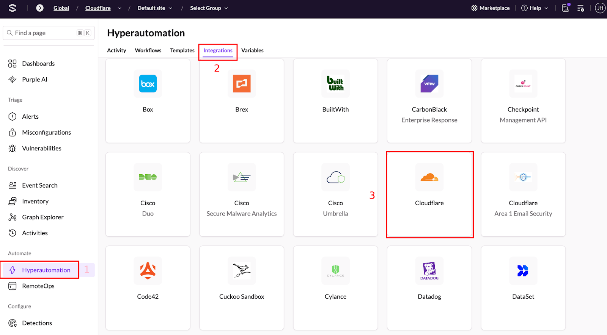
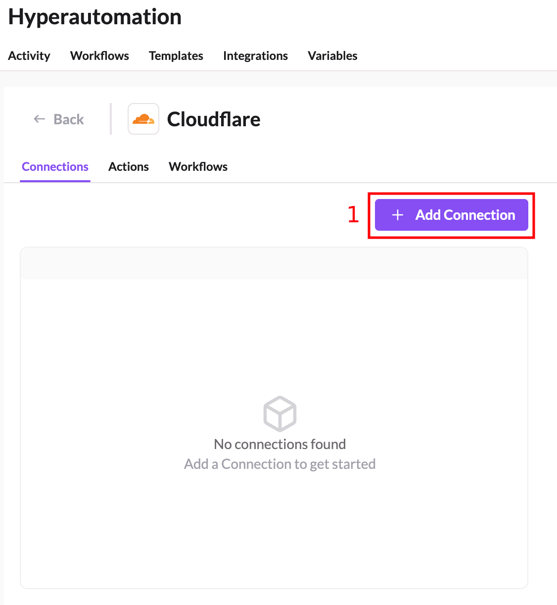
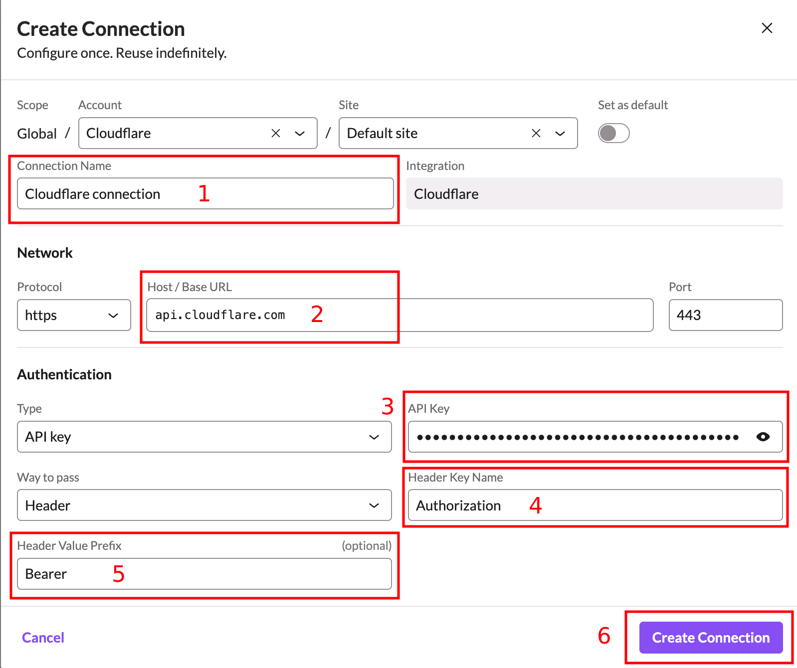

<!-- omit from toc -->
# Configuring Hyperautomation Integrations

Before getting started with these workflows, you’ll need to make sure you have a few integrations configured.  This document outlines how to configure the Hyperautomation integrations.

<!-- omit from toc -->
## Table of Contents

- [SentinelOne SDL (Required)](#sentinelone-sdl-required)
- [Cloudflare (Required)](#cloudflare-required)
- [Microsoft Entra ID (Optional)](#microsoft-entra-id-optional)
- [Okta (Optional)](#okta-optional)
- [Next Steps](#next-steps)

## SentinelOne SDL (Required)

The SentinelOne SDL integration is used by the workflow to send log messages that can be retrieved later for troubleshooting or for more easily reviewing what happened during a particular workflow execution.

To configure the integration:

1. In the SentinelOne console navigate to **Policies and Settings** (1) and then click **API Keys** (3) under **AI SIEM** (2).
   
   

2. On the **AI SIEM** page, click **New Key** (1) and then choose **New Write Key** (2).
   
   

3. Under **Key Name** (1) enter a name for the key such as `Hyperautomation Integration` and then click **Save** (2).
   
   

4. Repeat the previous 2 steps to create a **New Read Key** as well.

5. Back in the main **AI SIEM** screen, copy each the newly created keys to the clipboard (1) and then store them in a safe location for now.  You'll need them shortly.
   
   

6. Now navigate to **Hyperautomation** (1) and click on **Integrations** (2) and then scroll to find the **SentinelOne SDL** integration (3) and click on it.
   
   

7. Click the **+ Add Connection** button (1).
   
   

8. Enter a **Connection Name** (1) and a **Host/Base URL** (2) from the table below using the closest region to your geographic location. Paste the _write_ API key you created in step 4 into the **API Key** (3) field and click **Create Connection** (4).

    | Region | Host / Base URL Value |
    |-|-|
    | US | ingest.us1.sentinelone.net |
    | Canada | ingest.ca1.sentinelone.net |
    | Germany | ingest.eu1.sentinelone.net |
    | India | ingest.ap1.sentinelone.net |
    | Australia | ingest.apse2.sentinelone.net |
      
   
    
9.  Make a note of the **Connection Name** you used in the previous step.
    
10. Repeat the previous 3 steps to add a duplicate connection but instead use the _read_ API key and give the connection a unique name so you know that it is an SDL connection for querying data from SDL.

## Cloudflare (Required)

The Cloudflare integration is used by the workflows to perform various actions within your Cloudflare account.

To configure the integration:

1. Follow the steps to [create an API token](https://developers.cloudflare.com/fundamentals/api/get-started/create-token/) for your Cloudflare account ensuring that the token includes the following permissions:

    - **Account** | **Access: Organizations, Identity Providers and Groups** | **Revoke**
    - **Account** | **Account Filter Lists** | **Edit**
   
    

2. In the SentinelOne console navigate to **Hyperautomation** (1) and click on **Integrations** (2) and then scroll to find the **Cloudflare** integration (3) and click on it.
   
   

3. Click on **Add Connection** (1).
   
   

4. Enter a **Connection Name** (1) and ensure the **Host/Base URL** value (2) is set to `api.cloudflare.com`. Paste the API key you created in step 1 into the **API Key** value (3).  Change the **Header Key Name** value (4) to `Authorization` and set the **Header Value Prefix** value (5) to `Bearer` and then click **Create Connection** (6).
   
   

5. Make a note of the **Connection Name** you used in the previous step.

## Microsoft Entra ID (Optional)

If you wish to use Microsoft Entra ID to resolve usernames in alerts to actual email addresses from an Entra ID user’s account, you’ll need to configure this integration.  

Instructions for configuring this integration can be found on the SentinelOne Community portal here: https://community.sentinelone.com/s/article/000010844

Be sure to make a note of the **Connection Name** you use when configuring the integration.

## Okta (Optional)

If you wish to use Okta to resolve usernames in alerts to actual email addresses from an Okta user’s profile, you’ll need to configure this integration.  

Instructions for configuring this integration can be found on the SentinelOne Community portal here: 
https://community.sentinelone.com/s/article/000010846

Be sure to make a note of the **Connection Name** you use when configuring the integration.

## Next Steps

- [Return to Main Page](../README.md)
