<!-- omit from toc -->
# Workflow: Revoke Zero Trust Access on High IoC

<!-- omit from toc -->
## Table of Contents

- [Overview](#overview)
- [Architecture Diagram](#architecture-diagram)
- [Prerequisites](#prerequisites)
- [How It Works](#how-it-works)
- [Configuring the Workflow](#configuring-the-workflow)
- [Configuring the Custom Detection Rule](#configuring-the-custom-detection-rule)
- [Troubleshooting the Workflow](#troubleshooting-the-workflow)
- [Next Steps](#next-steps)

## Overview

Modern web attacks often start with "low-and-slow" reconnaissance or credential stuffing that may only be visible through aggregate log analysis rather than single-event triggers. While Cloudflare WAF provides "Log" or "Score" modes to monitor these trends, manually reviewing logs and updating rules to "Block" mode during an active incident introduces significant latency, leaving applications vulnerable during the detection-to-remediation gap. 

Cloudflare Logpush continuously streams WAF event data, including granular WAF Attack Scores, into the SentinelOne AI SIEM. When the SIEM detects a sustained threshold of high-risk traffic (e.g., Attack Score < 5) targeting a specific application path, it triggers this Hyperautomation workflow. The workflow immediately invokes the Cloudflare  API to dynamically update a blocklist with the source IP where the attack originated from. 

Organizations achieve a self-healing security perimeter. By bridging the gap between SIEM-based analytics and edge enforcement, customers can automatically harden their defenses against emerging threats in real-time, reducing the Mean Time to Remediate (MTTR) and ensuring that high-confidence threats are neutralized without manual intervention.

## Architecture Diagram

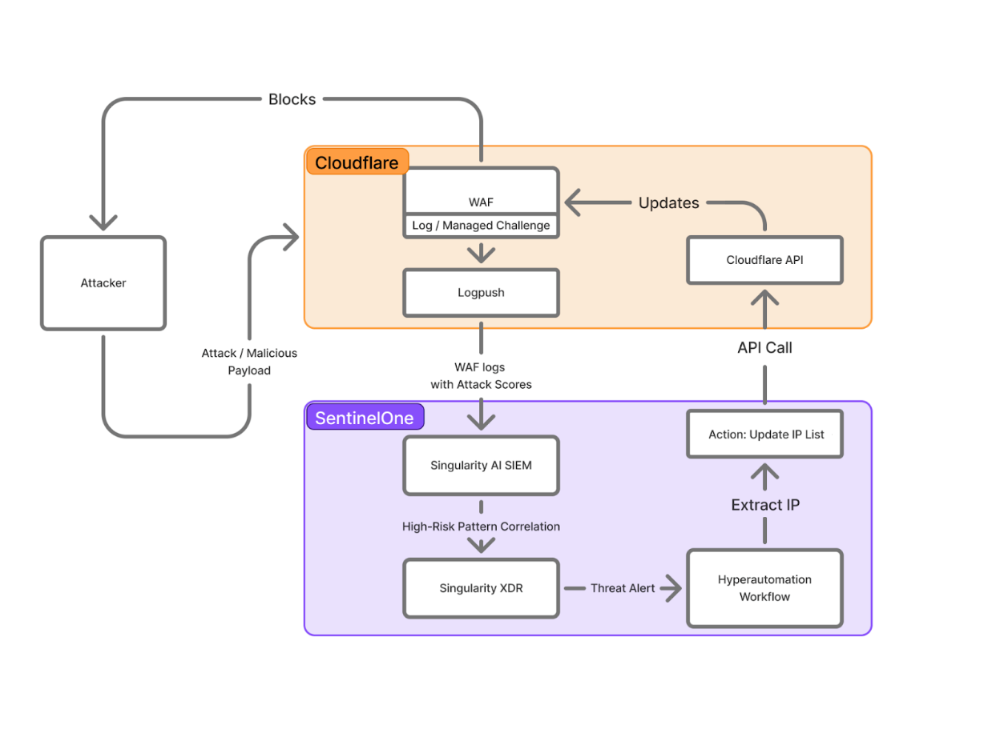

## Prerequisites

- Be sure you have [configured SentinelOne Hyperautomation integrations](./setting-up-hyperautomation-integrations.md). You’ll need the names of the connectors as noted in the documentation.

- You must [create a custom list](https://developers.cloudflare.com/waf/tools/lists/custom-lists/) in active Cloudflare which will be dynamically updated by this workflow.  You'll need to retrieve the ID of the list and store it for later use. You can find the ID by navigating to the list in the Cloudflare dashboard. It will be the last part of the URL.
  
  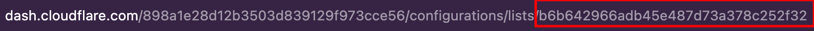

- You should have one or more [custom WAF rules](https://developers.cloudflare.com/waf/custom-rules/) that utilize the custom list to block traffic.
  
- [Set up and configure the SentinelOne integration](https://developers.cloudflare.com/logs/logpush/logpush-job/enable-destinations/sentinelone/) with Cloudflare LogPush to ensure logs are flowing into SentinelOne AI SIEM.
  
  _You'll need to configure **HTTP requests** and **Firewall events** logs to flow into SentinelOne AI SIEM at a minimum._

## How It Works

The overall process of how this workflow is triggered and runs is as follows:

1. Cloudflare logs continuously flow into SentinelOne AI SIEM via one or more Cloudflare LogPush jobs.
2. An attack is detected which flows through the logs into AI SIEM.
3. A custom detection rule triggers an alert in the SentinelOne console which causes the Hyperautomation workflow to run.
4. The raw alert data is queried from AI SIEM which includes the raw logs from Cloudflare.
5. The attacker's IP is extracted from the Cloudflare log data and then added automatically to the blocklist in Cloudflare which is being used by custom WAF rules to block attackers.

## Configuring the Workflow

1. Open the workflow **Cloudflare - Automated WAF Policy Enforcement based on Risk Score** by simply clicking on its name and then clicking the **Edit** link (1) at the top of the page when the workflow opens.
   
   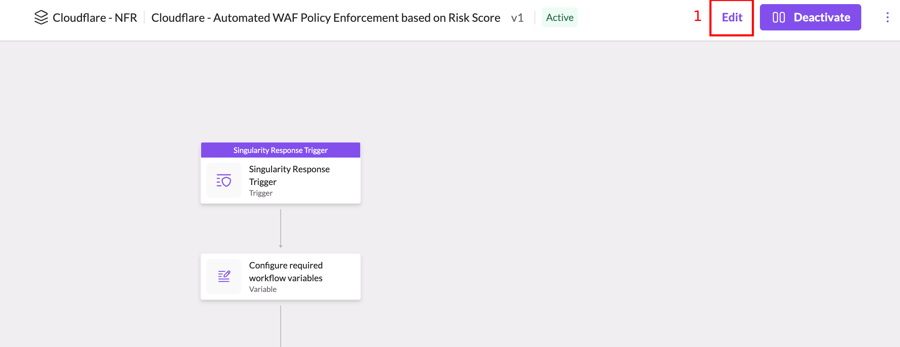

2. When the **Edit Workflow** dialog appears, click the **Edit a new draft** button (1) to confirm you wish to edit the workflow.
   
   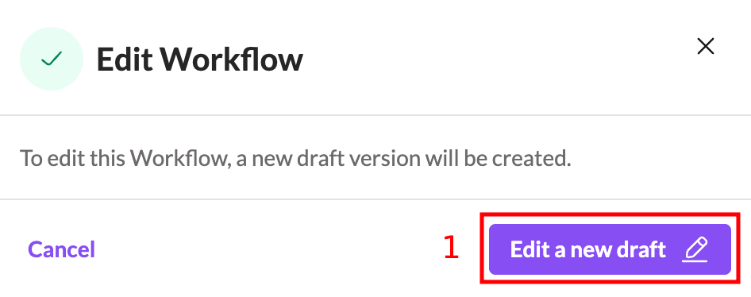
   
3. Zoom in to find the start of the workflow, which is the **Singularity Response Trigger** action (1) at the top. 
   
   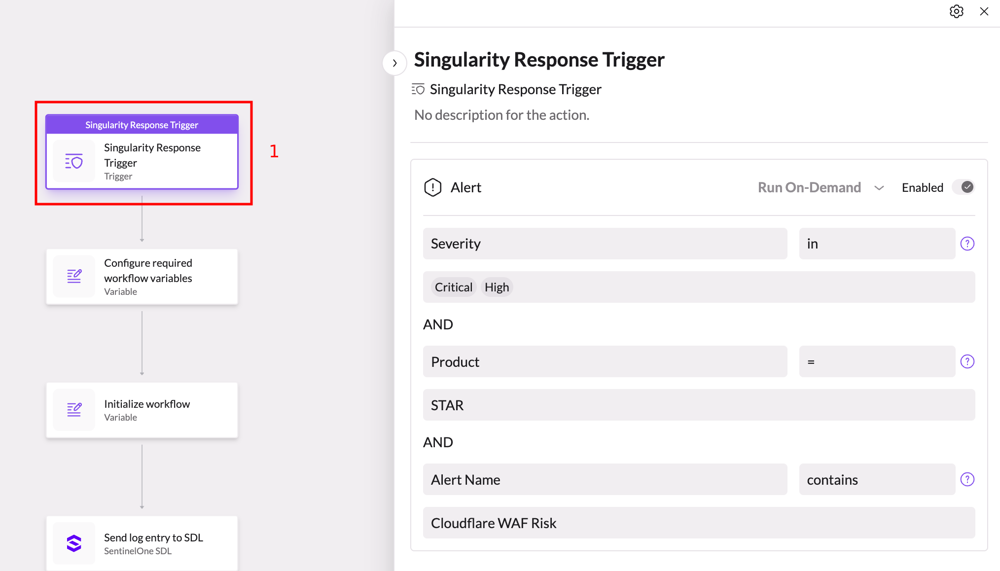
   
4. Click on the action in order to open it up and then, if desired, adjust the alert filters (1) on what alert conditions will trigger the workflow to run automatically.  The default values will cause the workflow to run any time an alert is triggered that is of **High** or **Critical** severity. Leave the **Product** and **Alert Name** filters alone.

    ***NOTE:***
    _This workflow is configured to work with **Alert** events only.  While you can add additional event filters to the trigger, you must make sure that you only add **Alert** event filters, otherwise the workflow may not function correctly._

   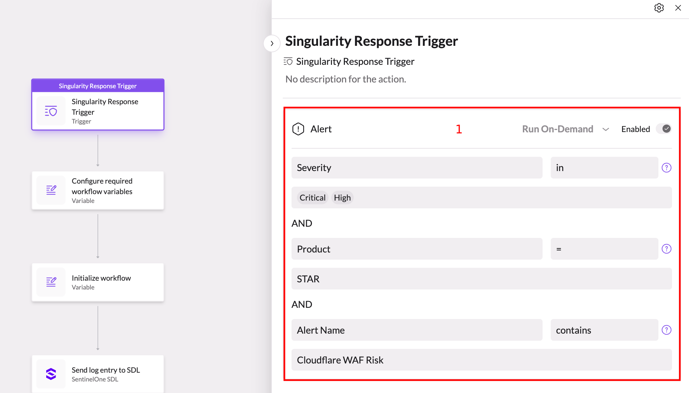
   

5. Next, click on the **Configure required workflow variables** action (1) to open it up and reveal the required variables that must be configured for your environment (2).
   
   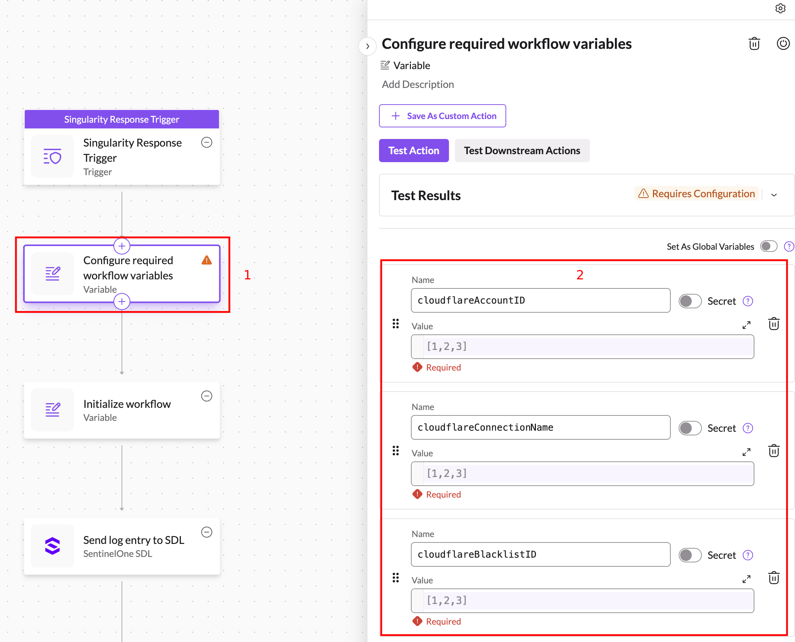
   
You ***must*** update the following values in the action for your environment:

_Be sure to surround all string values with double quotes (`"`)._

| Variable | Type | Description |
|-|-|-|
| `cloudflareAccountID` | `string` | The value should be set to the ID of the Cloudflare account where you have configured your application(s) and access policies. |
| `cloudflareConnectionName` | `string` | The value should be set to the name of the connection you created for Cloudflare earlier. |
| `cloudflareBlacklistID` | `string` | This is the ID of the custom list you created in your Cloudflare account to store blacklisted IP addresses. |
| `sdlReadConnectionName` | `string` | The value should be set to the name of the connection you created for the SentinelOne SDL integration that uses the _read key_. |
| `sdlWriteConnectionName` | `string` | The value should be set to the name of the connection you created for the SentinelOne SDL integration that uses the _write key_. |

6. Once you have finished configuring the variables, just click the **Activate** button (1) to activate the workflow, enter a brief description for the version (2) and then click the **Activate** button in the pop-up dialog (3).
   
   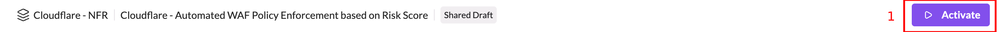
   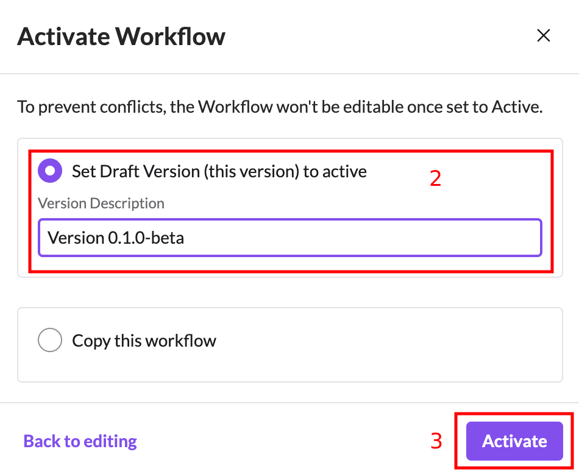

## Configuring the Custom Detection Rule

In order to trigger an alert from the log data flowing into AI SIEM from Cloudflare's LogPush job(s) (and subsequently trigger the workflow to run), you'll need to create a custom detection rule as follows:

1. Find and click the **Detections** menu item (1) on the left navigation menu in the SentinelOne console.

   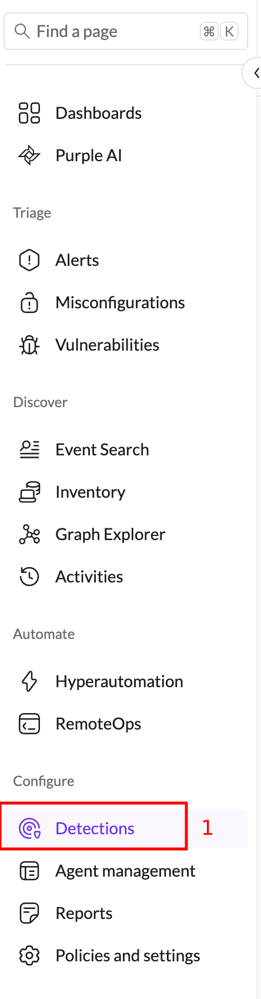

2. On the **Detections** screen, make sure that **Custom** (1) is selected and then click the **Create rule** button (2).

   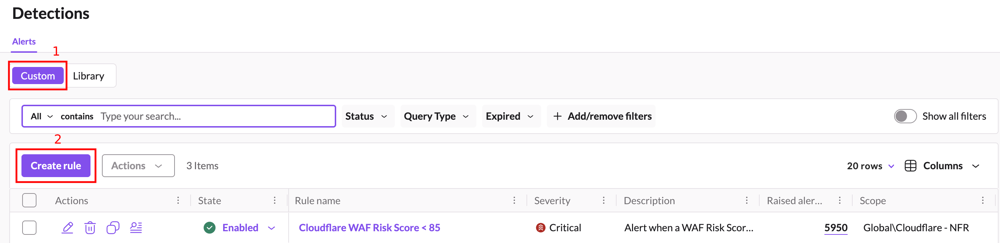

3. When the custom rule wizard appears, you'll need to fill in the following details:
   
   - **Scope** (1): Select the scope to which the custom detection rule will apply.  This should be the same scope that your workflow exists in.
   - **Name** (2): Give the detection rule a name to your liking.
   - **Description** (3): Give the detection rule a description to your liking.
   - **Severity** (4): Make sure **Critical** or **High** is selected for the severity level in order to make the workflow trigger properly.
   - **Expiration Date**: Set the rule to never expires (5).

   Click **Next** (6) once you've updated the details.

   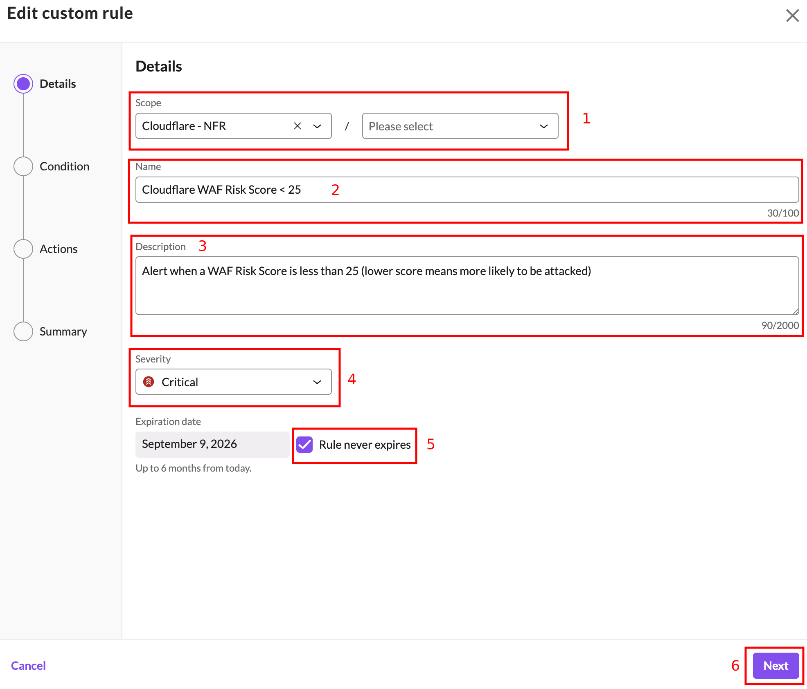

4. Make sure **Single event** (1) is selected as the condition and then for the **Query filter** (2), enter the following:

   ```text
   dataSource.name='Cloudflare' dataSource.cloudflare_dataset = 'HTTP Requests'  risk_score < 25
   ```

   You can adjust the value of `risk_score` to your liking.  The lower the number, the higher the actual risk that was found by Cloudflare.

   If you don't want the workflow to fire multiple times for the same alert, set the **Cool off period** (3) to your liking.

   Click **Next** to continue.

   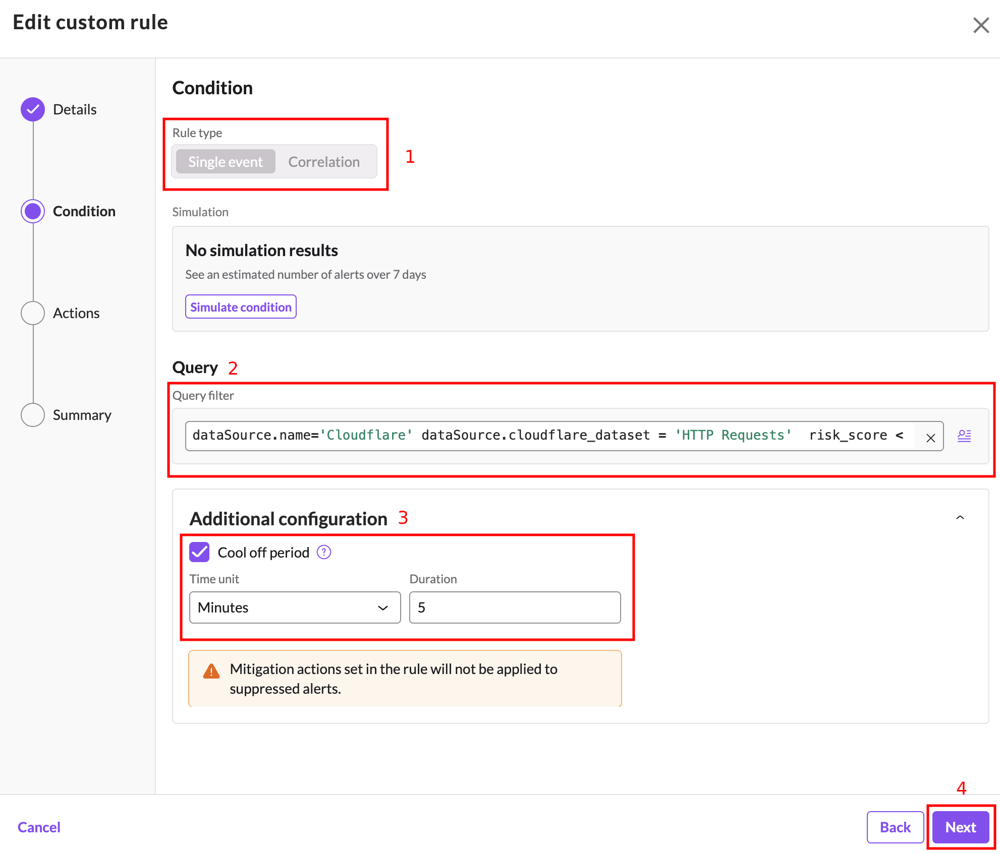

5. Enabling any **Active response** actions (1) is entirely up to you. If you wish to have this detection perform additional response actions other than running the workflow, you can enable those here.

   Click **Next** to continue.

   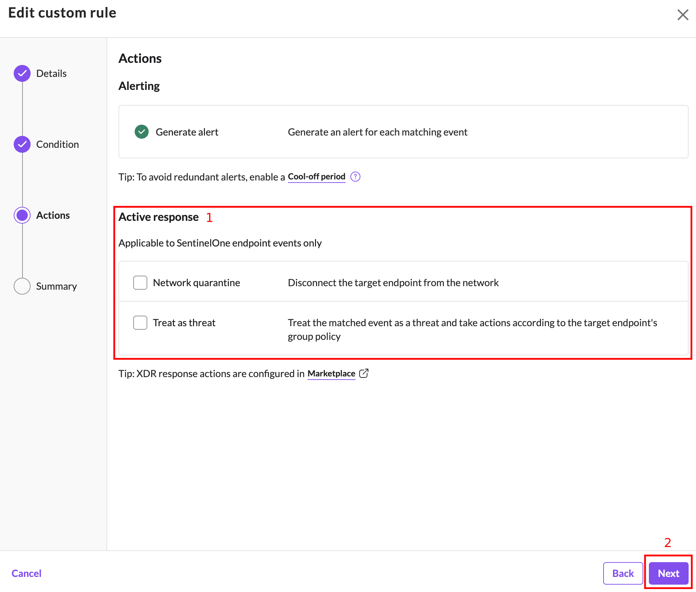

6. Verify the settings are correct and then make sure **Enable rule after saving** (1) is enabled and click the **Enable** button (2) to create and enable the rule.

   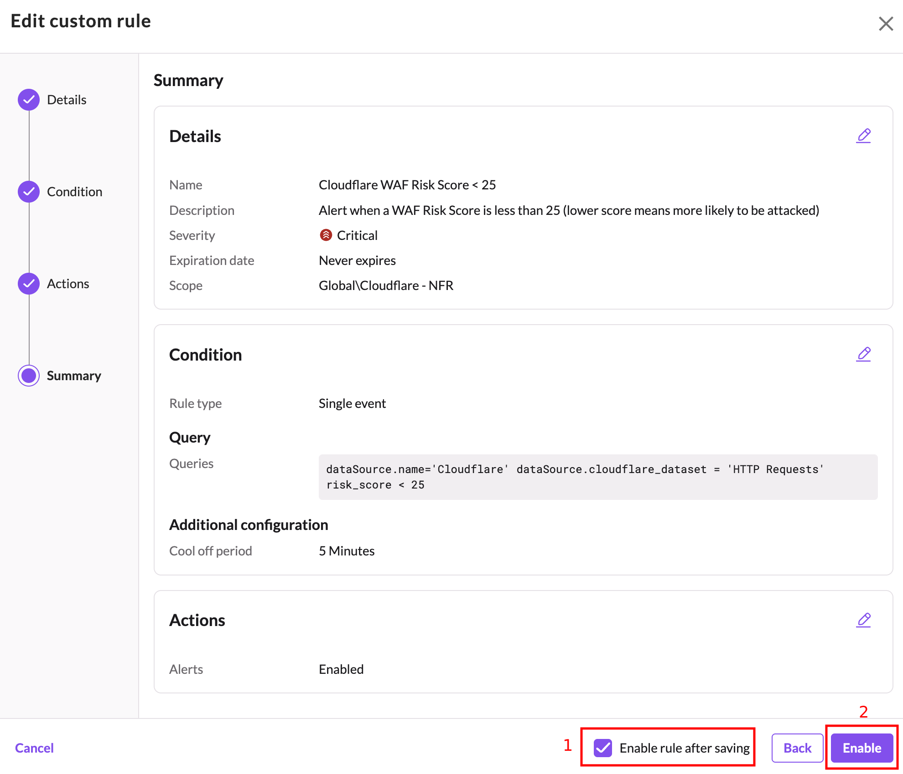

## Troubleshooting the Workflow

The workflow periodically logs messages to SentinelOne AI SIEM during execution. To review the log messages simply click **Event Search** in the navigation menu (1). Use the following search criteria:
   - Select **All Data** from the dropdown (2) 
   - Enter `dataSource.category='Workflow' dataSource.name='LogEntry' dataSource.vendor='Cloudflare'` for the search query (3).
   - Select an appropriate time range to search (4).
   - Click the **Search** button (5)
   
   

Simply review the log entries that are returned by clicking on any of them. Informational messages should show up with a medium severity level. Warnings should show up with a high severity level. Errors should show up with a critical severity level.

## Next Steps

- [Return to Main Page](../README.md)
