<!-- omit from toc -->
# Workflow: Revoke Zero Trust Access on High IoC

<!-- omit from toc -->
## Table of Contents

- [Overview](#overview)
- [Architecture Diagram](#architecture-diagram)
- [Prerequisites](#prerequisites)
- [How It Works](#how-it-works)
  - [Extracting the Email Address from the Alert](#extracting-the-email-address-from-the-alert)
  - [Revoking Cloudflare ZTA Active User Sessions](#revoking-cloudflare-zta-active-user-sessions)
- [Configuring the Workflow](#configuring-the-workflow)
- [Testing the Workflow](#testing-the-workflow)
- [Troubleshooting the Workflow](#troubleshooting-the-workflow)
- [Next Steps](#next-steps)

## Overview

Standard endpoint isolation stops a device from communicating with the network, but it does not kill active SaaS sessions (e.g., Salesforce, AWS, Microsoft 365) authenticated via Zero Trust. If a user's credentials are stolen alongside a device compromise, the attacker may pivot to unmanaged devices.

When SentinelOne detects a high-severity Indicator of Compromise (IOC) or Ransomware, this workflow orchestrates a complex response. It calls the Cloudflare Zero Trust API to revoke active user sessions immediately. This forces re-authentication (potentially with stricter MFA) across all apps, locking the user out regardless of the device they are using thereby further reducing the exposure and risk for any customer.  

## Architecture Diagram

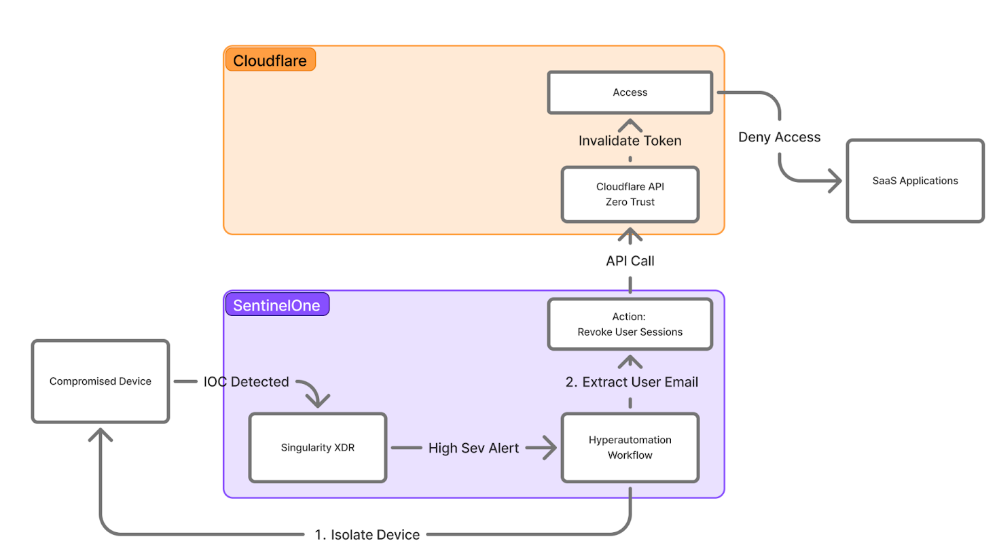

## Prerequisites

- Usernames should be consistent across end user workstations where SentinelOne alerts may be generated, any IdPs being used to resolve usernames to email addresses and any email addresses mapped to users defined in Cloudflare Access. (see details below in [How It Works](#how-it-works) and [Configuring the Workflow](#configuring-the-workflow))

- Be sure you have [configured SentinelOne Hyperautomation integrations](./setting-up-hyperautomation-integrations.md). You’ll need the names of the connectors as noted in the documentation.

- You must have active Cloudflare Access policies protecting internal/SaaS applications. Be sure to [add your applications](https://developers.cloudflare.com/cloudflare-one/access-controls/applications/) and [assign a corresponding access policy](https://developers.cloudflare.com/cloudflare-one/access-controls/policies/policy-management/#create-a-policy).

## How It Works

This section provides an overview of the actions performed by this workflow.  The behaviors described in this section are the default behaviors and can be disabled or altered based on configuration settings defined in the Configuring the Workflow section below, so be sure to read that section as well.

### Extracting the Email Address from the Alert
This workflow starts by attempting to extract an email address or username from a SentinelOne alert.  It uses the following process:

1. If any OCSF evidence present in the alert contains an email address, that email address will be used in the [Revoking Cloudflare ZTA Active User Sessions](#revoking-cloudflare-zta-active-user-sessions) actions.  If multiple OCSF evidences are present in an alert, the first one containing an email address is used.
2. If any OCSF evidence present in the alert contains a process username or an OS username, that will be used as the username.  If multiple OCSF evidences are present in an alert, the first one containing a username is used.
3. If no OCSF evidence is present or it does not contain an email address or username, the process username is used.  If a process username is not present, the last logged in username is used. 
4. If no username is found by this point, the workflow will abort and do nothing.

The next action the workflow performs is to “normalize” the username as follows:

1. If the username found in the alert is itself an email address, it will be used in the [Revoking Cloudflare ZTA Active User Sessions](#revoking-cloudflare-zta-active-user-sessions) actions.
2. If the username found is in standard Windows domain format (eg: `DOMAIN\username`), the DOMAIN and subsequent backslash (`\`) character are stripped from the username.
3. Add any defined prefix and/or suffix to the username.

If a supported IdP is enabled, the workflow then uses the normalized username as the primary ID when querying the IdP.  If a matching identity is found and an email address is present in the user’s profile/account, it will be used in the [Revoking Cloudflare ZTA Active User Sessions](#revoking-cloudflare-zta-active-user-sessions) actions.

**For Microsoft Entra ID:**
The `mail` field in the user’s account is used.

**For Okta:**
The `email` field in the user’s profile is used.

If no email address has been retrieved from any IdP at this point, one of the following actions will occur:
1. If the normalized username is itself an email address, it will be used in the [Revoking Cloudflare ZTA Active User Sessions](#revoking-cloudflare-zta-active-user-sessions) actions.
2. If the username is not an email address, the workflow will abort and do nothing.

### Revoking Cloudflare ZTA Active User Sessions

Once the workflow reaches this point, the email address that was discovered from the first part of the workflow is then used as the identifier for the Cloudflare Access user account.  Any active sessions that the user has through Cloudflare Access, including any WARP sessions and active devices, will be revoked.  This will cause the user to lose access to those applications and force them to re-authenticate.

## Configuring the Workflow

1. Open the workflow **Cloudflare - Revoke Zero Trust Access on High IoC** by simply clicking on its name and then clicking the **Edit** link (1) at the top of the page when the workflow opens.
   
   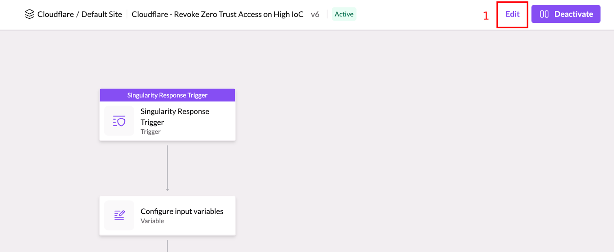

2. When the **Edit Workflow** dialog appears, click the **Edit a new draft** button (1) to confirm you wish to edit the workflow.
   
   
   
3. Zoom in to find the start of the workflow, which is the **Singularity Response Trigger** action (1) at the top. 
   
   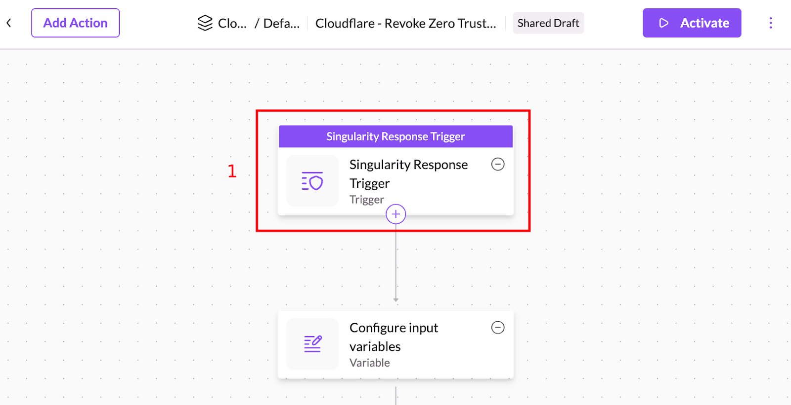
   
4. Click on the action in order to open it up and then, if desired, adjust the alert filters (1) on what alert conditions will trigger the workflow to run automatically.  The default values will cause the workflow to run any time an alert is triggered that is classified as **Ransomware**, **Malware** or an **Infostealer** and is of **High** or **Critical** severity.

    ***NOTE:***
    _This workflow is configured to work with **Alert** events only.  While you can add additional event filters to the trigger, you must make sure that you only add **Alert** event filters, otherwise the workflow may not function correctly._

   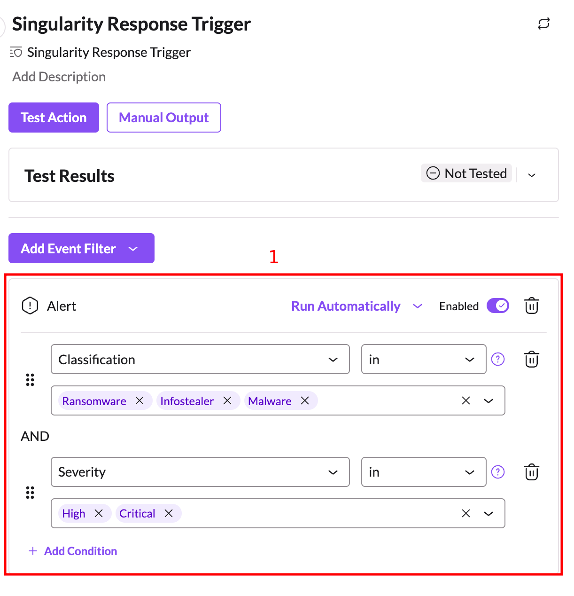
   

5. Next, click on the **Configure required workflow variables** action (1) to open it up.
   
   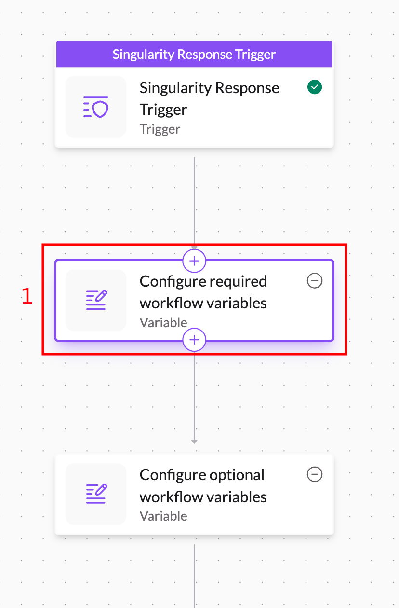
   
You ***must*** update the following values in the action for your environment:

_Be sure to surround all string values with double quotes (`"`)._

| Variable | Type | Description |
|-|-|-|
| `cloudflareAccountID` | `string` | The value should be set to the ID of the Cloudflare account where you have configured your application(s) and access policies. |
| `cloudflareConnectionName` | `string` | The value should be set to the name of the connection you created for Cloudflare earlier. |
| `idp` | `string` | This is the IdP platform that will be used when resolving usernames to email addresses. It _must_ be one of the values in the supported IdP table below or else the workflow will abort. |
| `idpConnectionName` | `string` | The value should be set to the name of the IdP connection you created earlier.  If `idp` is set to `none`, you may leave this as an empty string.  An example for the Microsoft Entra ID integration is shown below:   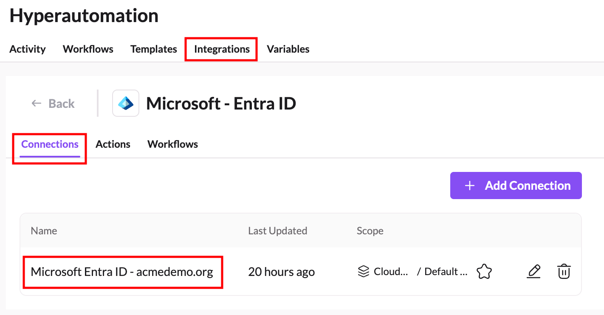  In this example, `idpConnectionName` should be set to `"Microsoft Entra ID - acmedemo.org"`. |
| `sdlWriteConnectionName` | `string` | The value should be set to the name of the connection you created for the SentinelOne SDL integration that uses the _write key_. |

The following IdPs are supported:

| Supported `idp` Value | Identity Provider | 
|-|-|
| `msentra` | Micrsoft Entra ID |
| `okta` | Okta |
| `none` | Do not attempt to resolve usernames to email addresses via an IdP |

6. Next, click on the Configure optional workflow variables action (1) to open it up.
   
   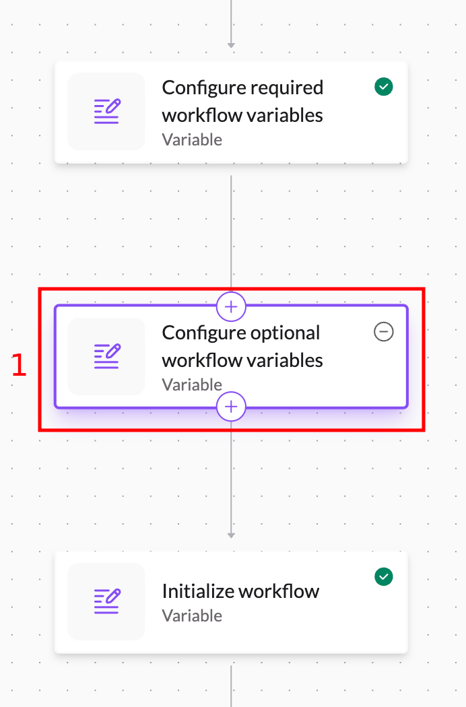
   
These variables all have reasonable default values set for you and do not necessarily need to be changed.  However, you should review them to ensure they are properly configured for your specific environment.

_Be sure to surround all string values with double quotes (`"`)._

| Variable | Type | Description |
|-|-|-|
| `idpUsernameFallbackEmailDomain` | `string` | This domain will be appended to the username retrieved from the alert if no email address could be found during an IdP lookup or if IdP lookups are disabled and the username from the alert is not already an email address.  The email address for the username is constructed by stripping off any Windows domain prefix (anything up to the first `\` character) and then adding an `@` symbol plus this domain name. Do ***not*** include the `@` symbol in this string.  It is added automatically.  This value is ignored if `useIdPUsernameAsFallback` is false. |
| `idpUsernamePrefix` | `string` | This string is added to the beginning of a username before it is sent to the IdP for lookup. It should be an empty string if no prefix is desired. |
| `idpUsernameSuffix` | `string` | This string is added to the end of a username before it sent to the IdP for lookup. It should be an empty string if no suffix is desired.
| `useIdPUsernameAsFallback` | `bool` | If set to `true` and no email address can be found from an IdP, fallback to using the username found in the alert. If the username is an email address already, it will be used automatically.  If it is not an email address, append `idpUsernameFallbackEmailDomain` to the username to create the email address. If set to `false` and no email address was found in the IdP, the workflow will abort. |

7. Once you have finished configuring the variables, just click the **Activate** button (1) to activate the workflow, enter a brief description for the version (2) and then click the **Activate** button in the pop-up dialog (3).
   
   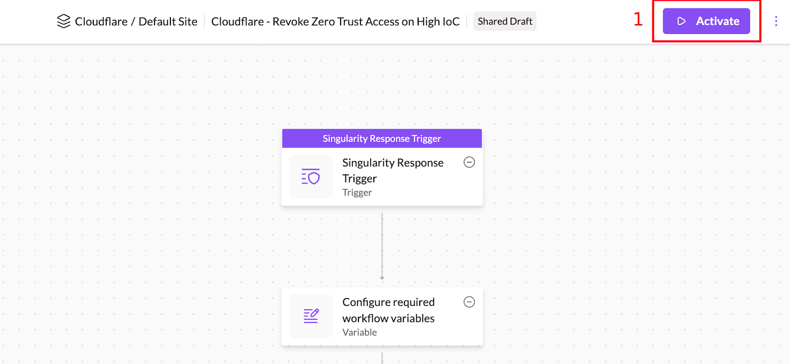
   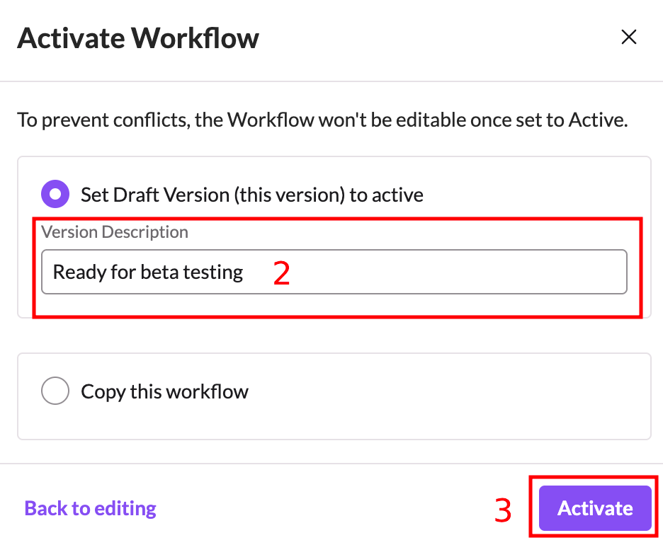

## Testing the Workflow

If you wish to manually test the workflow:

1. Open the workflow and click on the **Singularity Response Trigger** action (1) at the top where it begins and then click the **Manual Output** button (2).
   
   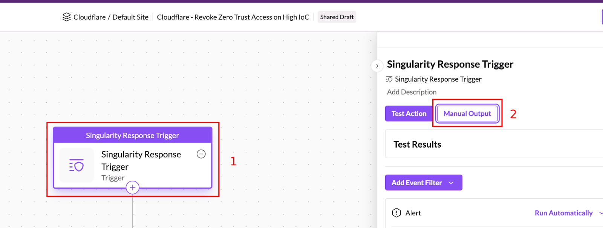

2. In the **Manual Test Output** window, replace the contents of the text area (1) with the contents of [this sample file](https://github.com/Sentinel-One/ai-siem/tree/main/workflows/community/Cloudflare/examples/high-ioc-alert.json) and click the **Use as Output** button (2).
   
   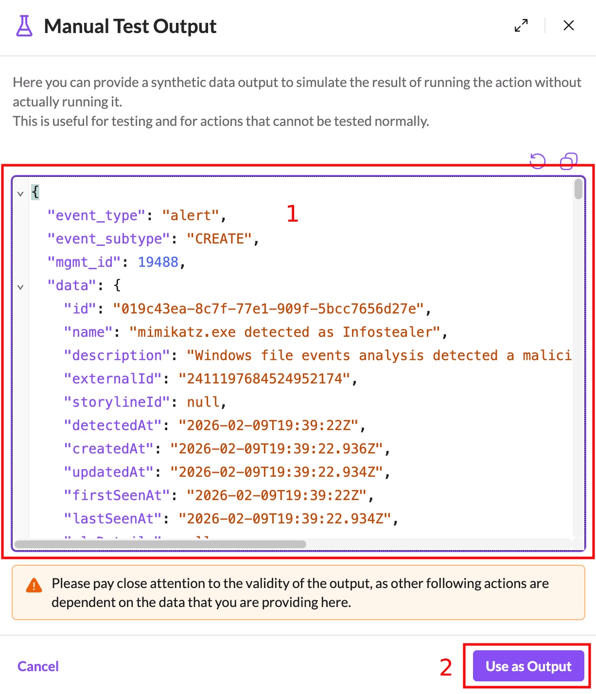

3. Back in the workflow, click on the **Configure required workflow variables** action (1) and then click the **Test Downstream Actions** button (2).
   
   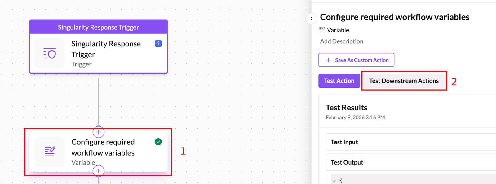

4. The workflow should run from there and you can test / troubleshoot as necessary.

## Troubleshooting the Workflow

The workflow periodically logs messages to SentinelOne AI SIEM during execution. To review the log messages simply click **Event Search** in the navigation menu (1). Use the following search criteria:
   - Select **All Data** from the dropdown (2) 
   - Enter `dataSource.category='Workflow' dataSource.name='LogEntry' dataSource.vendor='Cloudflare'` for the search query (3).
   - Select an appropriate time range to search (4).
   - Click the **Search** button (5)
   
   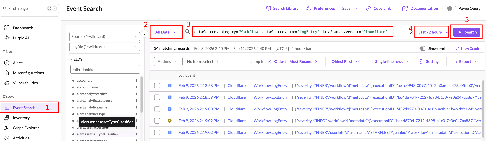

Simply review the log entries that are returned by clicking on any of them. Informational messages should show up with a medium severity level. Warnings should show up with a high severity level. Errors should show up with a critical severity level.

## Next Steps

- [Return to Main Page](../README.md)
