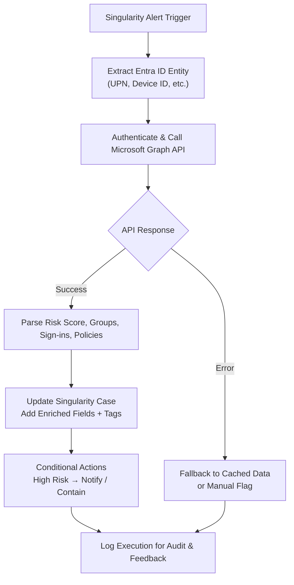

# Enrich Entra ID Information from Alert

**Vendor**: Microsoft Entra ID  
**Workflow ID**: enrich-entra-id-information  
**Version**: v1.0  
**Category**: Identity Enrichment

## Purpose

Automatically enrich SentinelOne Singularity alerts containing Entra ID entities (user, device, sign-in events, etc.) with additional context from Microsoft Graph / Entra ID. This includes risk levels, group memberships, sign-in history, and conditional access details to speed up triage and enable better response decisions.

## Mermaid Workflow Diagram

	
## Use Case

Triggers: Alerts with identity signals (risky sign-in, compromised user, anomalous device behavior).
Value: Analysts get rich context directly in the Singularity console without switching tools.
Hyperautomation Potential: This serves as a reusable building block for agentic/MCP-driven flows.

## Dependencies

Microsoft Graph API permissions (User.Read.All, Device.Read.All, AuditLog.Read.All recommended)
SentinelOne Singularity API access for case updates

## Implementation Details
See `workflow.json` for the full JSON definition.