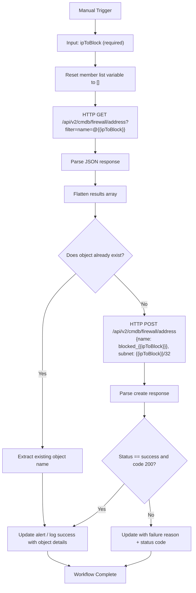

# add_ip_to_fortigate_blocklist

**Version**: 1.0.0  
**Last Updated**: 2026-04-04

## Purpose
Adds a provided IP address to the FortiGate firewall blocklist. The workflow first checks if an address object for that IP already exists. If it does not, it creates a new /32 host address object named `blocked_{IP}` with an appropriate comment. This is commonly used as a containment action for IOCs or malicious IPs identified by SentinelOne.

## Trigger
- **Type**: Manual (with dynamic input for the IP to block)
- **Conditions**: None (manual execution)

## Integration Dependencies
- FortiGate Firewall REST API (v2) – requires authenticated connection with permissions to read/write `firewall/address` objects
- SentinelOne HyperAutomation

## Detailed Workflow Diagram (JSON-aligned)

