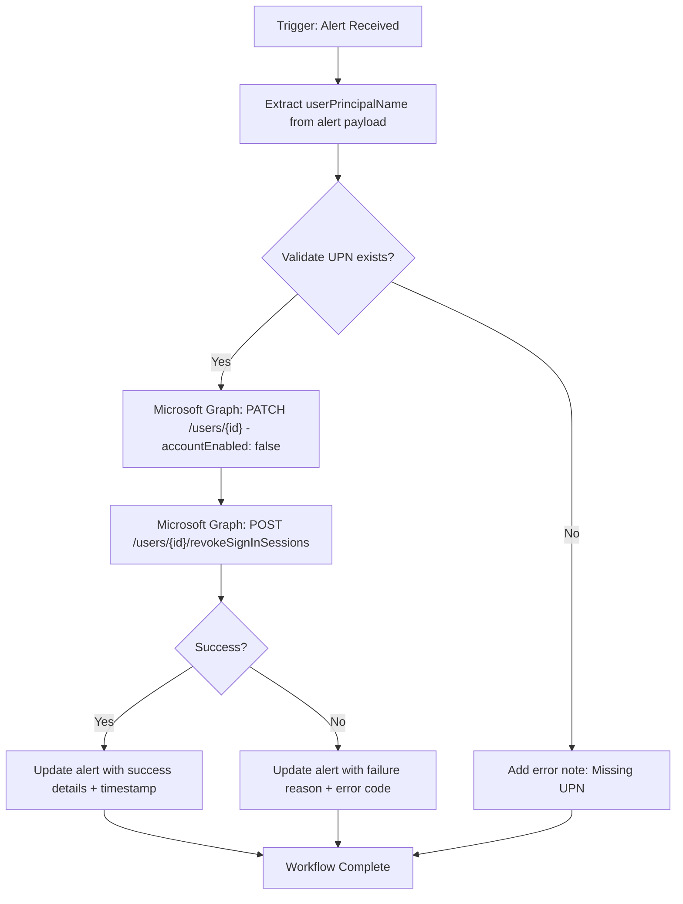

# [M365] Disable User

**Version**: 1.0.0  
**Last Updated**: 2026-03-27

## Purpose
Automatically disables a Microsoft 365 user account when triggered by a high-severity alert. This serves as a rapid containment action to prevent further lateral movement or data access by a potentially compromised account.

## Trigger
- **Type**: Alert (SentinelOne AI SIEM or Singularity XDR)
- **Conditions**: High severity alert involving user compromise indicators

## Integration Dependencies
- Microsoft Graph API (Users.ReadWrite.All permission)
- SentinelOne HyperAutomation

## Detailed Workflow Diagram (JSON-aligned)

## Execution Steps (Directly from JSON)

1. Parse userPrincipalName or userId from incoming alert payload.
2. Call Microsoft Graph PATCH /users/{id} to set accountEnabled: false.
3. Call Microsoft Graph POST /users/{id}/revokeSignInSessions.
4. Update the original alert note with success/failure details and timestamp.
