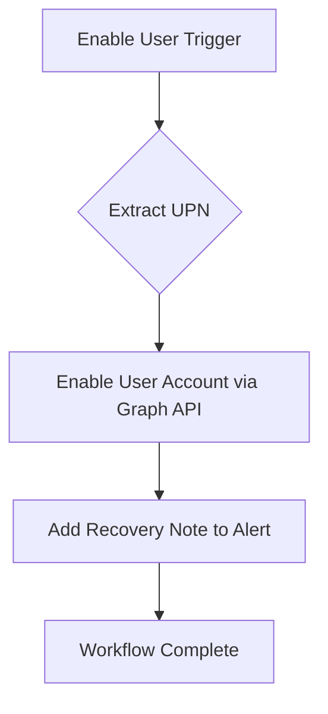

# [M365] Enable User

**Version**: 1.0.0  
**Last Updated**: 2026-03-27

## Purpose
Re-enables a Microsoft 365 user account that was previously disabled. This workflow supports account recovery processes and remediation of false-positive disable actions.

## Trigger
- **Type**: Alert or Manual
- **Conditions**: Legitimate recovery request or false-positive detection

## Integration Dependencies
- Microsoft Graph API (Users.ReadWrite.All permission)
- SentinelOne HyperAutomation

## Workflow Diagram

## Execution Steps

1. Extract user principal name from payload.
2. Enable the user account in Microsoft 365.
3. Add note documenting the recovery action.
