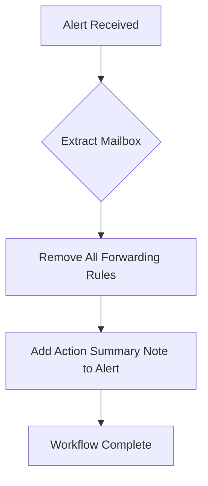

# [M365] Remove All Mail Forwarding Rules from Mailbox

**Version**: 1.0.0  
**Last Updated**: 2026-03-27

## Purpose
Removes all mailbox forwarding rules to prevent data exfiltration. Attackers commonly create forwarding rules to silently exfiltrate email after initial compromise.

## Trigger
- **Type**: Alert
- **Conditions**: Indicators of mailbox compromise or suspicious forwarding rule creation

## Integration Dependencies
- Microsoft Graph API (Mail.ReadWrite.All or MailboxSettings.ReadWrite)
- Exchange Online PowerShell or Graph API
- SentinelOne HyperAutomation

## Workflow Diagram

## Execution Steps

1. Identify target mailbox from alert payload.
2. Clear all forwarding rules (ForwardingSmtpAddress, etc.).
3. Document the remediation in the alert note.
