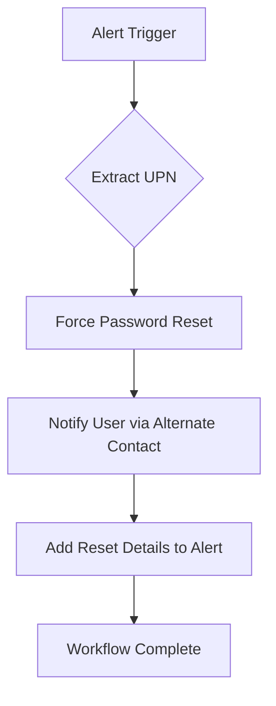

# [M365] Reset Password

**Version**: 1.0.0  
**Last Updated**: 2026-03-27

## Purpose
Forces a password reset on a Microsoft 365 user account to invalidate stolen or compromised credentials.

## Trigger
- **Type**: Alert
- **Conditions**: Credential compromise indicators (e.g., password spray, unusual sign-ins)

## Integration Dependencies
- Microsoft Graph API (UserAuthenticationMethod.ReadWrite.All)
- SentinelOne HyperAutomation

## Workflow Diagram

## Execution Steps

1. Extract user principal name.
2. Force password reset via Graph API.
3. Optionally notify user and log the action.
