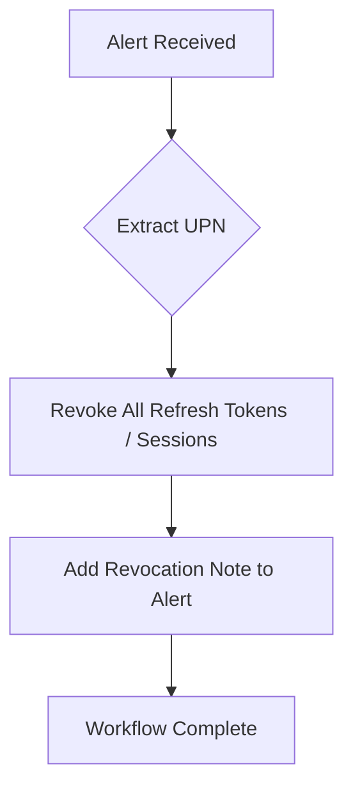

# [M365] Revoke User Session

**Version**: 1.0.0  
**Last Updated**: 2026-03-27

## Purpose
Revokes all active Microsoft 365 / Entra ID sessions for a user, forcing re-authentication. This is a critical containment action against active session hijacking or token theft.

## Trigger
- **Type**: Alert
- **Conditions**: Indicators of session compromise or high-risk sign-in

## Integration Dependencies
- Microsoft Graph API (Directory.AccessAsUser.All or equivalent)
- Entra ID
- SentinelOne HyperAutomation

## Workflow Diagram

## Execution Steps

1. Parse userPrincipalName or userId from incoming alert payload.
2. Call Microsoft Graph PATCH /users/{id} to set accountEnabled: false.
3. Call Microsoft Graph POST /users/{id}/revokeSignInSessions.
4. Update the original alert note with success/failure details and timestamp.

## Detailed JSON-aligned Workflow
See ./diagram.mmd for the full step-by-step representation matching the HyperAutomation JSON nodes (Graph API calls, conditions, error paths, alert updates).
