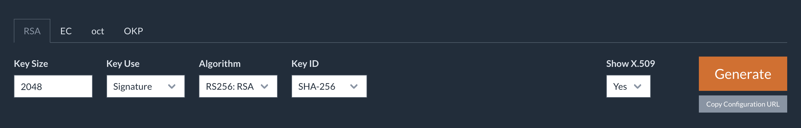
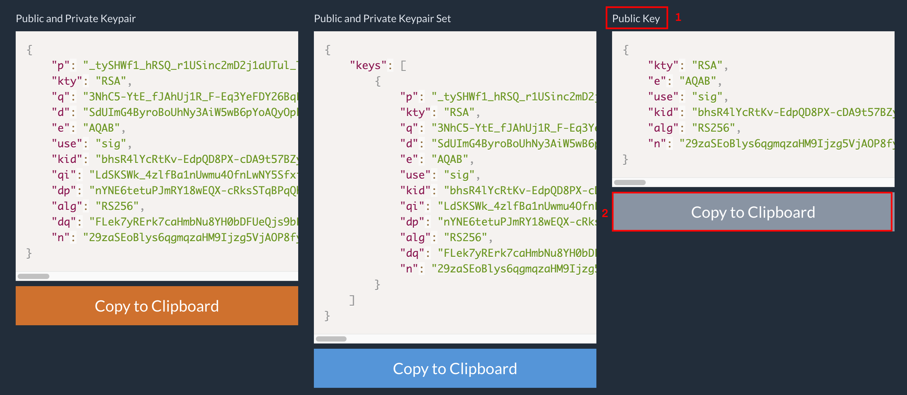
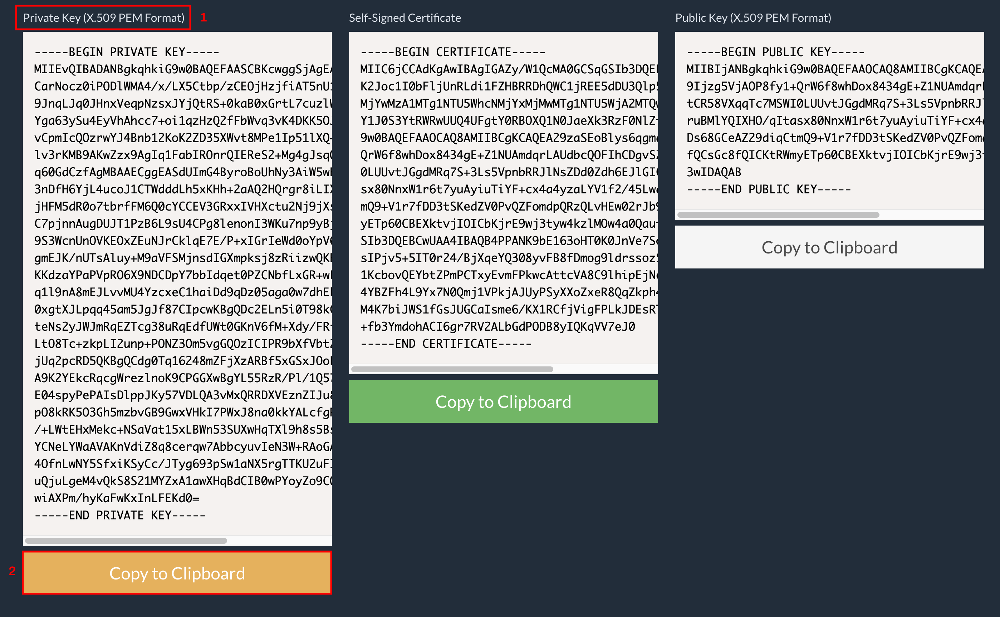
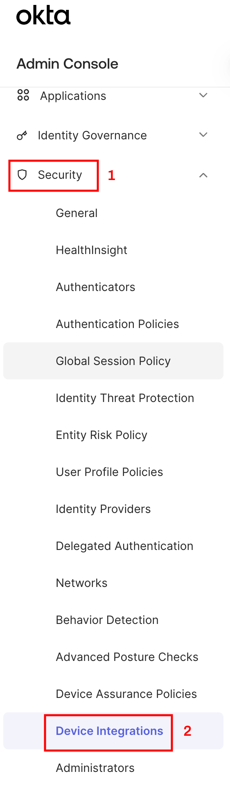
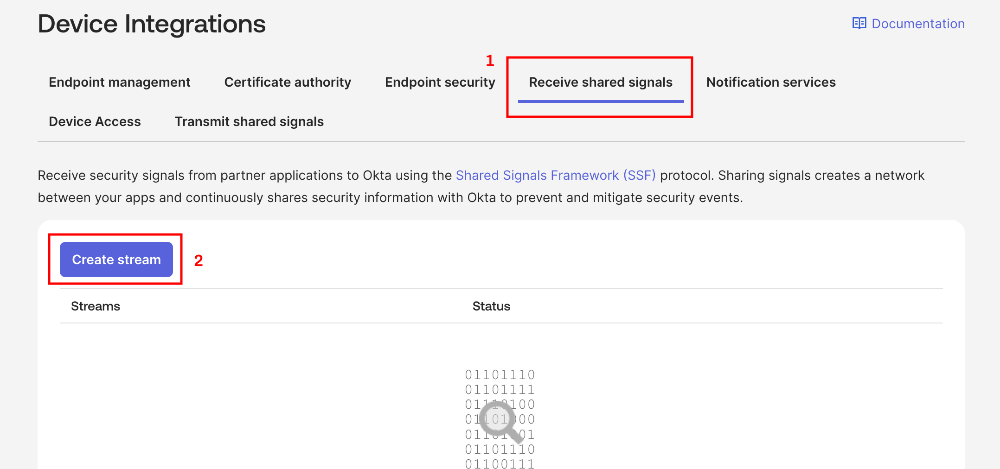
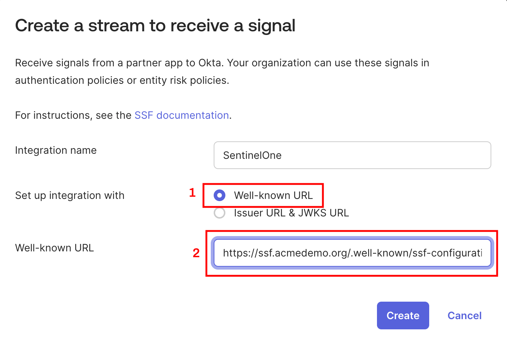

<!-- omit from toc -->
# Configuring Okta Shared Signals Framework

This document describes how to properly configure Okta's SSF features for receiving alerts from third parties such as SentinelOne.

You will need an administrator to configure Okta using these steps and may need to work with your PKI team for creating the signing keys for the JWTs used in the workflows.

These steps are current as of this release of the workflow.  You should, however, also refer back to [Okta's official documentation](https://developer.okta.com/docs/guides/configure-ssf-receiver/main/) on setting up an SSF receiver.

<!-- omit from toc -->
## Table of Contents

- [Generate JSON Web Key Set (JWKS)](#generate-json-web-key-set-jwks)
- [Create an SSF-Compliant Provider](#create-an-ssf-compliant-provider)
- [Configure Okta to Receive Shared Signals](#configure-okta-to-receive-shared-signals)
- [Next Steps](#next-steps)

## Generate JSON Web Key Set (JWKS)

The first thing you'll need to do is to generate the keys required for signing the event content from SentinelOne in order to send it to Okta using SSF.

1. Use this simple [JSON Web Key generator](https://mkjwk.org/) to generate a JWKS public/private key pair for testing purposes only with this guide. 
   
   _For production purposes, be sure to generate and store private keys in accordance with your security policies._

2. Be sure the **RSA** tab is selected and then use the following values in the JWKS tool to generate the key pair on the RSA tab:

    - **Key Size**: 2048
    - **Key Use**: Signature
    - **Algorithm**: RS256
    - **Key ID**: SHA-256
    - **Show X.509**: Yes
  
   

3. Click **Generate**.
4. Click the **Copy to Clipboard** button (2) underneath the box labeled **Public Key** (1) and save the contents to a new file. We'll call this file `jwks.json` for now.

   

5. Click the **Copy to Clipboard** button (2) underneath the box labeled **Private Key (X.509 PEM Format)** (1) and save the contents to a file. We'll call this file `jwks.pem` for now.

   

6. Open the `jwks.json` file you created in step 4 and modify it to wrap your single key in an array by adding the first two lines below and the last two lines to your file:

   ```json
   {
     "keys": [
        <ADD YOUR KEY HERE>
     ]
   }
   ```

   Given the values from the screenshot in step 4, the resulting file would look like this:

   ```json
   {
     "keys": [
       {
         "kty": "RSA",
         "e": "AQAB",
         "use": "sig",
         "kid": "bhsR4lYcRtKv-EdpQD8PX-cDA9t57BZyy7G1t6Vm02M",
         "alg": "RS256",
         "n": "29zaSEoBlys6qgmqzaHM9Ijzg5VjAOP8fy1-QrW6f8whDox8434gE-Z1NUAmdqrLAUdbcQOFIhCDgvSZ6iyatCR58VXqqTc7MSWI0LUUvtJGgdMRq7S-3Ls5VpnbRRJlNsZDd0Zdh6EJlGIGut8kruBMlYQIXHO_qItasx80NnxW1r6t7yuAyiuTiYF-cx4a4yzaLYV1f2_45LwqZiHEDs68GCeAZ29diqCtmQ9-V1r7fDD3tSKedZV0PvQZFomdpQRzQLvHEw02rJb96yjAfQCsGc8fQICKtRWmyETp60CBEXktvjIOICbKjrE9wj3tyw4kzlMOw4a0QautBnQs3w"
       }
     ]
   }
   ```

## Create an SSF-Compliant Provider 

In order for the workflow and Okta's SSF receiver to verify the private key used to sign the event data encoded in the JWT, you'll need to serve the public key from a webserver somewhere.  You can use any public-facing web service you desire, but you *should* use HTTPS with a certificate signed by a well-known certificate authority.  AWS S3 + CloudFront, Cloudflare Pages and GitHub Pages are just a few options.

You'll need to be able to serve 2 files:

1. First upload the `jwks.json` file somewhere on your web server so that it can be publicly accessed without any authentication.  This file *only* contains the public key so there is no risk in making the file publicly accessible.
2. Next create and upload a new file called `ssf-configuration`, adding the following contents to it:
   
   ```json
   {
     "issuer": "https://FQDN_OF_YOUR_SERVER",
     "jwks_uri": "https://FQDN_OF_YOUR_SERVER/PATH_TO_jwks.json_FILE"
   }
   ```

   For example, if the name of your host is `ssf.acmedemo.org` and you saved the `jwks.json` file so that it is accessible at `https://ssf.acmedemo.org/keys/jwks.json`, then the contents of the `ssf-configuration` file would be:

   ```json
   {
     "issuer": "https://ssf.acmedemo.org",
     "jwks_uri": "https://ssf.acmedemo.org/keys/jwks.json"
   }
   ```
3. You **must** make the `ssf-configuration` file available from your web server using the "well-known" URI `/.well-known/ssf-configuration` and ensure when the file itself is served that your webserver notifies the requesting client that the `Content-Type` is `application/json`.

   For Nginx, you could use the following snippet to accomplish this:

   ```text
   location /.well-known/ssf-configuration {
     root   /usr/share/nginx/html;
     types { } default_type "application/json";
   }
   ```

   Continuing our example, the `ssf-configuration` file would be accessible from `https://ssf.acmedemo.org/.well-known/ssf-configuration`

## Configure Okta to Receive Shared Signals

You now need to enable your Okta organization to receive security signals from SentinelOne using SSF.

1. In your Okta tenant's Admin Console, expand the **Security** menu (1) and click the **Device Integrations** item (2).
 
   

2. Click the **Receive shared signals** tab (1) and then click the **Create stream** button (2).

   
   
3. Configure the stream as follows:
   
   - Enter any name you'd like for the integration.
   - Make sure that **Well-known URL** is selected (1)
   - Enter the well-known URL (2) from the previous section.  Using our example, the value would be `https://ssf.acmedemo.org/.well-known/ssf-configuration`

   

4. Click the **Create** button to create the stream.

If the stream is created successfully, it will appear in the stream list in the Okta Admin Console. The status is set to **Active** by default.

## Next Steps

- [Return to Main Page](../README.md)
