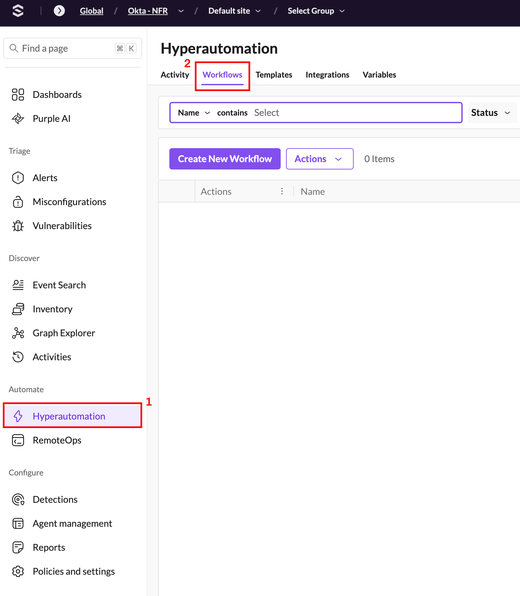
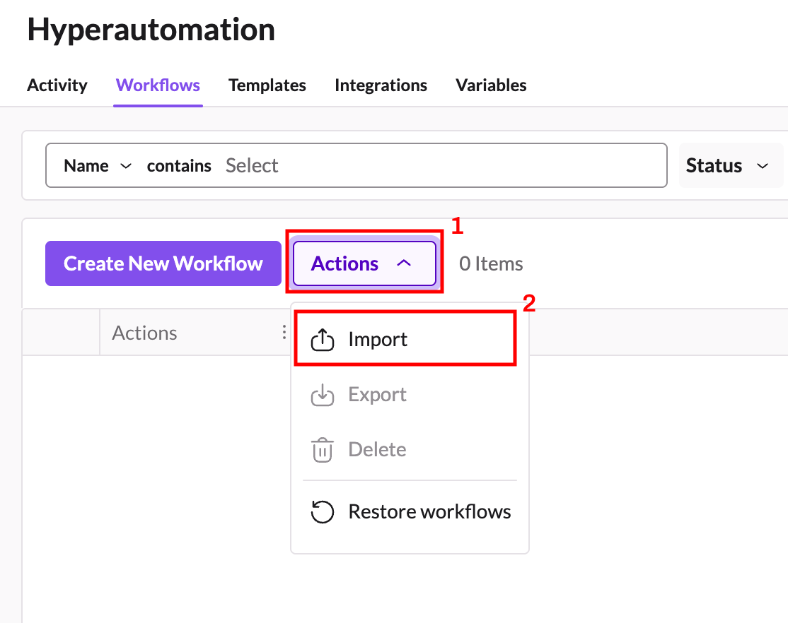
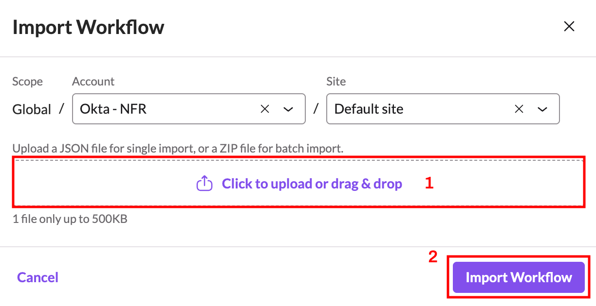
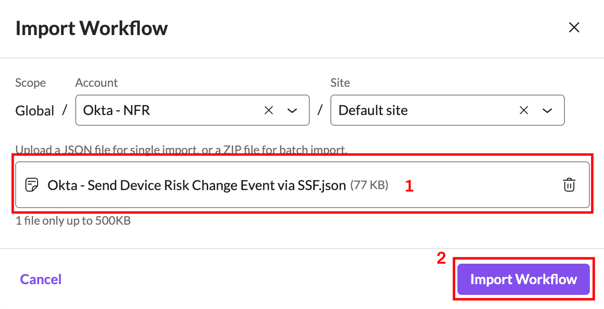

<!-- omit from toc -->
# Importing the workflows

This document outlines how to download and import the custom Okta workflows for Hyperautomation into your SentinelOne account.

<!-- omit from toc -->
## Table of Contents

- [Download the Workflows](#download-the-workflows)
- [Import the Workflows into Your SentinelOne Account](#import-the-workflows-into-your-sentinelone-account)
- [Next Steps](#next-steps)

## Download the Workflows

To download the workflow files one at a time, simply open a web browser and navigate to https://github.com/Sentinel-One/ai-siem/tree/main/workflows/community/Okta/src.  

Each JSON file in the folder represents a single workflow.  Download each one you wish to import onto your local machine.  You’ll import them into your SentinelOne account in the next section.

Alternatively, you can also just download an archive of this repository and find them under the `/workflows/community/Okta/src` folder.

## Import the Workflows into Your SentinelOne Account

Now that you have downloaded the workflows to your machine, you’ll need to import them into your SentinelOne account via the console:

1. Log into your SentinelOne console and navigate to the site in which you wish to import the workflow(s).
2. Click the **Hyperautomation** menu on the left-side of the screen (1) and then click **Workflows** at the top (2).
   
   

3. From the **Actions** menu (1) click **Import** (2) which will open up the **Import Workflow** dialog.

   

4. On the **Import Workflow** dialog, either drag and drop or click the upload link (1) and browse to the folder in which you previously downloaded the workflow files.  Choose the file corresponding to the workflow you wish to import to upload it and then click the  **Import Workflow** button (2) to import the workflow.

   
   
   
5. Repeat steps 3 and 4 for any additional workflows you wish to upload.

## Next Steps

- [Configure Hyperautomation Integrations](./setting-up-hyperautomation-integrations.md)
- [Return to Main Page](../README.md)
