<!-- omit from toc -->
# Workflow: Send Device Risk Change Event via SSF

<!-- omit from toc -->
## Table of Contents

- [Overview](#overview)
- [Prerequisites](#prerequisites)
- [How It Works](#how-it-works)
  - [General Process](#general-process)
  - [Extracting the User from the Alert](#extracting-the-user-from-the-alert)
- [Configuring the Workflow](#configuring-the-workflow)
- [Testing the Workflow](#testing-the-workflow)
- [Troubleshooting the Workflow](#troubleshooting-the-workflow)
- [Next Steps](#next-steps)

## Overview

When SentinelOne detects a high-severity Indicator of Compromise (IOC) or Ransomware, this workflow orchestrates sending a device risk event via SSF to Okta which can then revoke active user tokens immediately or follow any number of other workflows. This forces re-authentication (potentially with stricter MFA) across all apps, locking the user out regardless of the device they are using thereby further reducing the exposure and risk for any customer.

## Prerequisites

- Usernames should be consistent across end user workstations where SentinelOne alerts may be generated and Okta as it is used to resolve usernames to email addresses. (see details below in [How It Works](#how-it-works) and [Configuring the Workflow](#configuring-the-workflow))

- Be sure you have [configured SentinelOne Hyperautomation integrations](./setting-up-hyperautomation-integrations.md). You’ll need the names of the connectors as noted in the documentation.

- You should [create an Entity Risk Policy](https://help.okta.com/oie/en-us/content/topics/itp/add-entity-risk-policy-rule.htm) in Okta which is triggered by a **Security Events Provider Reported Risk** with a **High** entity risk level if you wish to have Okta take an action when the event is transmitted via SSF.

## How It Works

This section provides an overview of the actions performed by this workflow.  The behaviors described in this section are the default behaviors and can be disabled or altered based on configuration settings defined in the [Configuring the Workflow](#configuring-the-workflow) section that follows.

### General Process

1. The workflow extracts the alert severity along with the machine name from the asset(s) present in the alert.
2. An email address for the user logged into the device is extracted from the OCSF evidence alert if any is present.
3. If no email address is found, the username found in the alert is extracted and then Okta is queried to retrieve the user's email address.
4. A new device risk event is created using the alert severity, the machine name and the user's email address and is sent via SSF to Okta.
5. Any entity risk policies that have been defined in Okta are triggered by the event and its data is logged to the Okta System Log.

If no device or username/email address can be retrieved from the alert itself, the workflow will abort.

### Extracting the User from the Alert

SentinelOne alerts typically contain OS usernames which may or may not directly match up with Okta usernames or email addresses.  This workflow uses the following process to map an OS username to an Okta email address:

1. If any OCSF evidence present in the alert contains an email address, that email address will be used.  
   
   _**NOTE**: If multiple OCSF evidences are present in an alert, the first one containing an email address is used._

2. If any OCSF evidence present in the alert contains a process username or an OS username, that will be used as the username.  
   
   _**NOTE**: If multiple OCSF evidences are present in an alert, the first one containing a username is used._

3. If no OCSF evidence is present or it does not contain an email address or username, the process username is used.  If a process username is not present, the last logged in username is used. 
4. If no username is found by this point, the workflow will abort and do nothing.

The next action the workflow performs is to “normalize” the username as follows:

1. If the username found in the alert is itself an email address, it will be used directly.
2. If the username found is in standard Windows domain format (eg: `DOMAIN\username`), the DOMAIN and subsequent backslash (`\`) character are stripped from the username.
3. Add any defined prefix and/or suffix to the username.
4. Search the Okta tenant for a matching username and retrieve the `email` field from their profile.
5. If no email address was found, the workflow will abort.

## Configuring the Workflow

1. Open the workflow **Okta - Send Device Risk Change Event via SSF** by simply clicking on its name and then clicking the **Edit** link (1) at the top of the page when the workflow opens.
   
   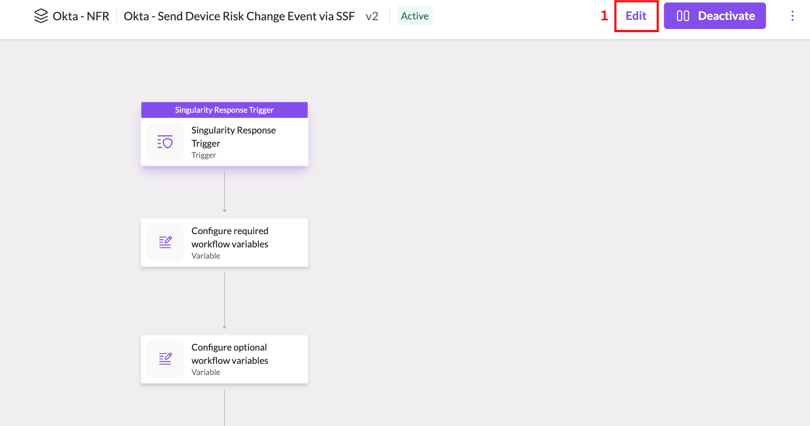

2. When the **Edit Workflow** dialog appears, click the **Edit a new draft** button (1) to confirm you wish to edit the workflow.
   
   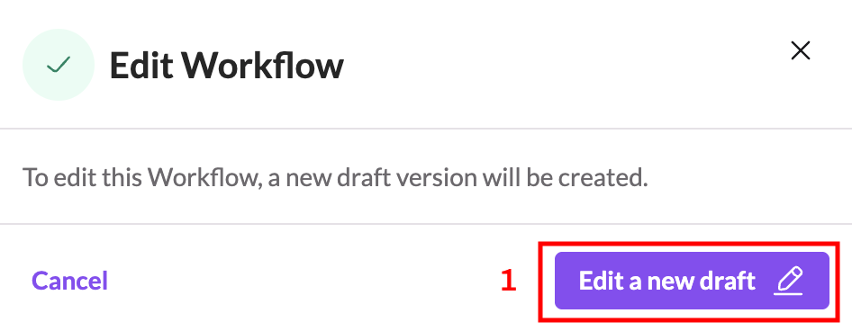
   
3. Zoom in to find the start of the workflow, which is the **Singularity Response Trigger** action (1) at the top. 
   
   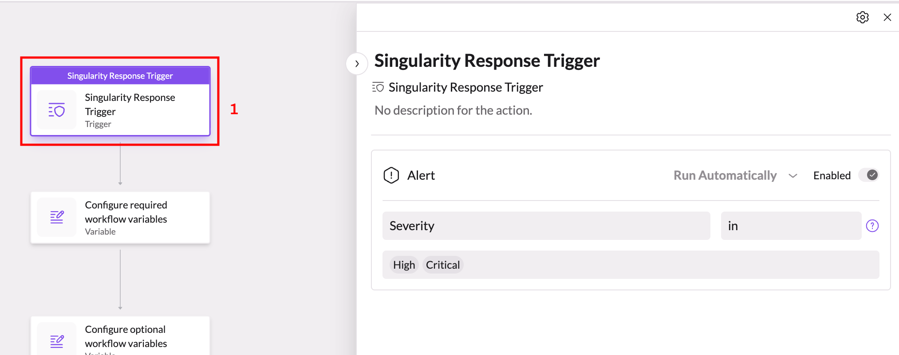
   
4. Click on the action in order to open it up and then, if desired, adjust the alert filters (1) on what alert conditions will trigger the workflow to run automatically.  The default values will cause the workflow to run any time an alert is triggered that is classified as **High** or **Critical** severity.

    ***NOTE:***
    _This workflow is configured to work with **Alert** events only.  While you can add additional event filters to the trigger, you must make sure that you only add **Alert** event filters, otherwise the workflow may not function correctly._

   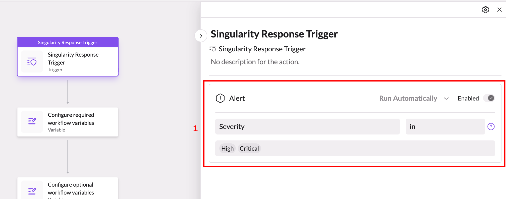
   

5. Next, click on the **Configure required workflow variables** action (1) to open it up and show the required variables (2).
   
   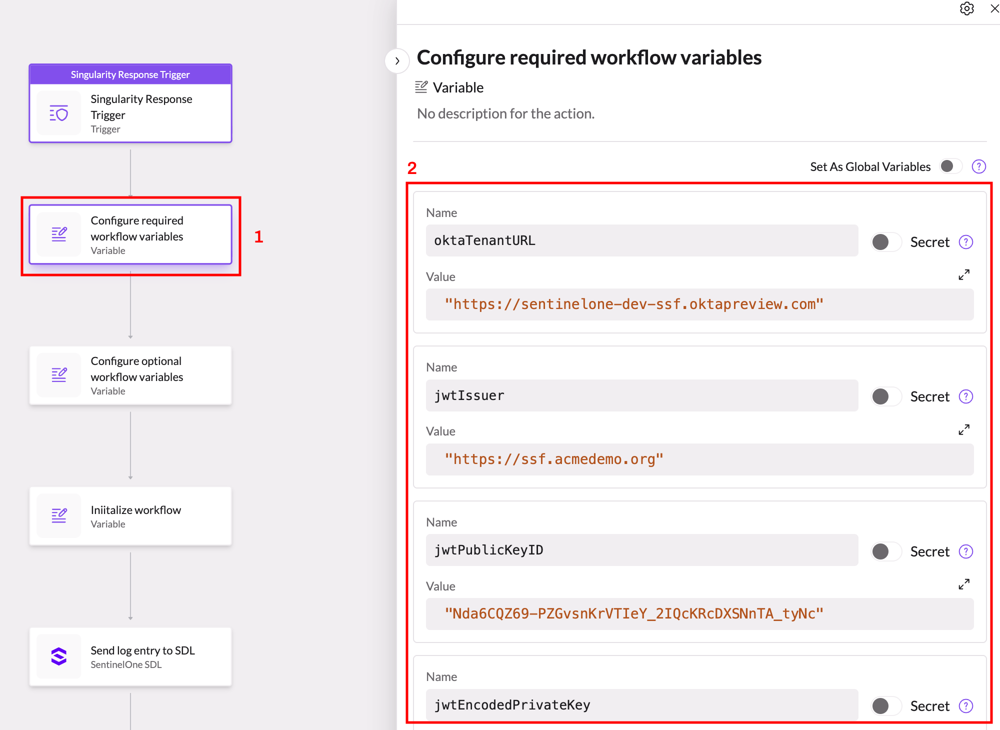
   
   You ***must*** update the following values in the action for your environment:

   _Be sure to surround all string values with double quotes (`"`)._

   | Variable | Type | Description |
   |-|-|-|
   | `oktaTenantURL` | `string` | The base URL for your Okta tenant |
   | `jwtIssuer` | `string` | The issuer that is used to generate JWTs - this should be the base URL where your "well-known" SSF configuration is stored and should match the `issuer` field in the file (see [Create an SSF Compliant Provider](./configure-okta-ssf#create-an-ssf-compliant-provider)). |
   | `jwtPublicKeyID` | `string` | The value of the `kid` field of the public key defined in the `jwks.json` file hosted by your SSF provider (see [Generate a JSON Web Key Set (JWKS)](./configure-okta-ssf#generate-json-web-key-set-jwks)). |
   | `jwtEncodedPrivateKey` | `string` | The contents of the private key (see [Generate a JSON Web Key Set (JWKS)](./configure-okta-ssf#generate-json-web-key-set-jwks)) encoded using Base64 |
   | `oktaConnectionName` | `string` | The name of the connection you created for the Okta integration. |
   | `sdlWriteConnectionName` | `string` | The name of the connection you created for the SentinelOne SDL integration. |

6. Next, click on the Configure optional workflow variables action (1) to open it up and show the optional variables (2).
   
   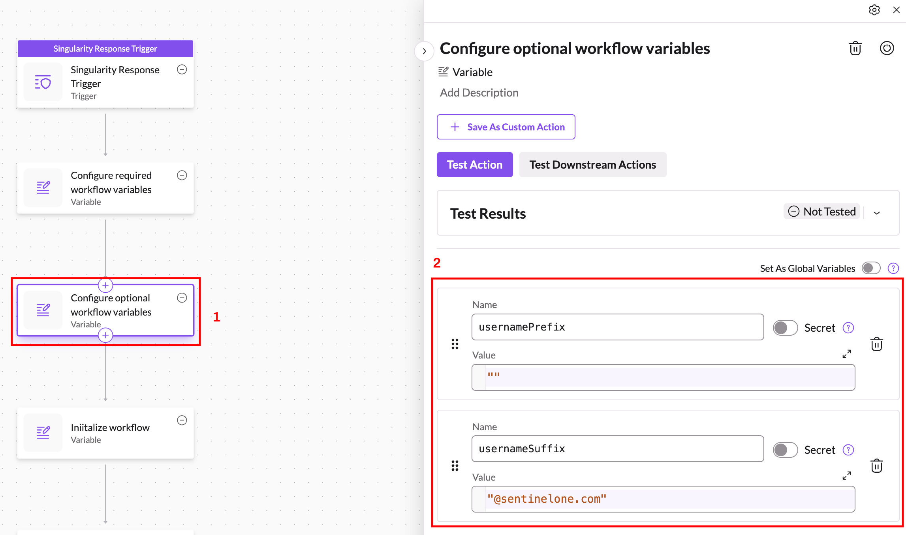
   
   These variables all have reasonable default values set for you and do not necessarily need to be changed.  However, you should review them to ensure they are properly configured for your specific environment.

   _Be sure to surround all string values with double quotes (`"`)._

   | Variable | Type | Description |
   |-|-|-|
   | `usernamePrefix` | `string` | This string is added to the beginning of a username before it is sent to Okta for lookup. It should be an empty string if no prefix is desired. |
   | `usernameSuffix` | `string` | This string is added to the end of a username before it sent to Okta for lookup. It should be an empty string if no suffix is desired.

7. Once you have finished configuring the variables, just click the **Activate** button (1) to activate the workflow, enter a brief description for the version (2) and then click the **Activate** button in the pop-up dialog (3).
   
   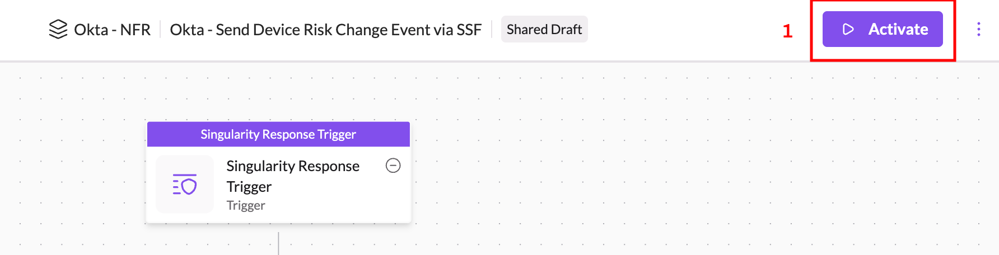
   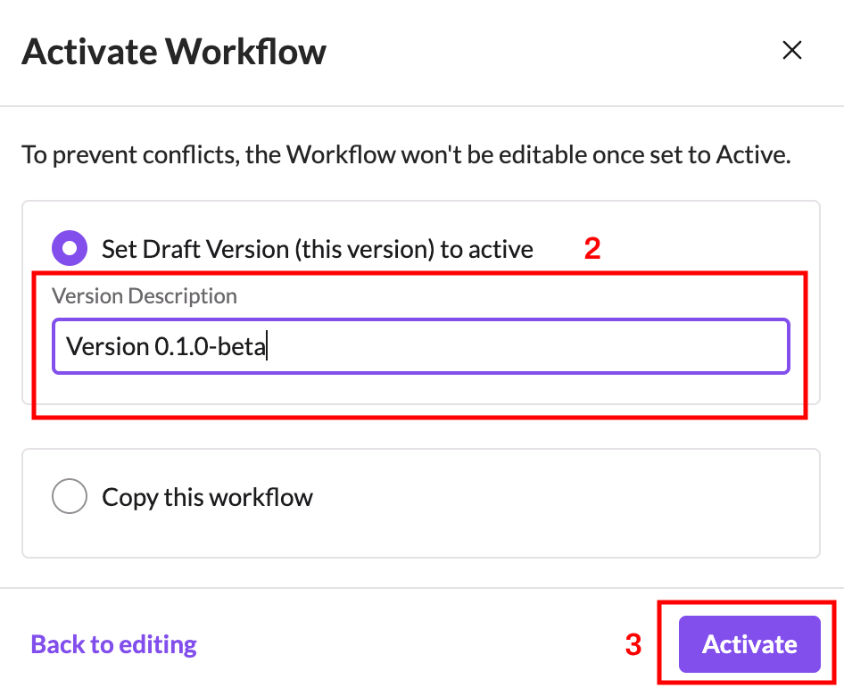

## Testing the Workflow

If you wish to manually test the workflow:

1. Open the workflow and click on the **Singularity Response Trigger** action (1) at the top where it begins and then click the **Manual Output** button (2).
   
   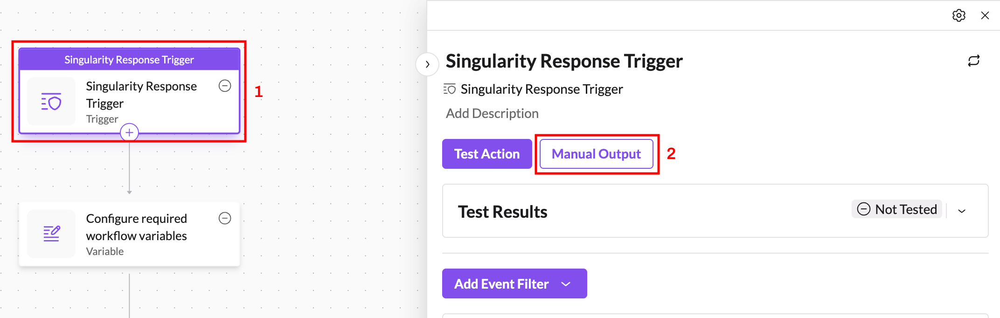

2. In the **Manual Test Output** window, replace the contents of the text area (1) with the contents of [this sample file](../examples/high-alert-example.json).
   
   You'll need to do a search and replace for the following values:

   - `__USERNAME__` -- replace this with an actual Okta username from your tenant
   - `__DEVICE__` -- replace this with an actual device that belongs to that Okta user in your tenant
   
   Click the **Use as Output** button (2) when you've replaced the values.
   
   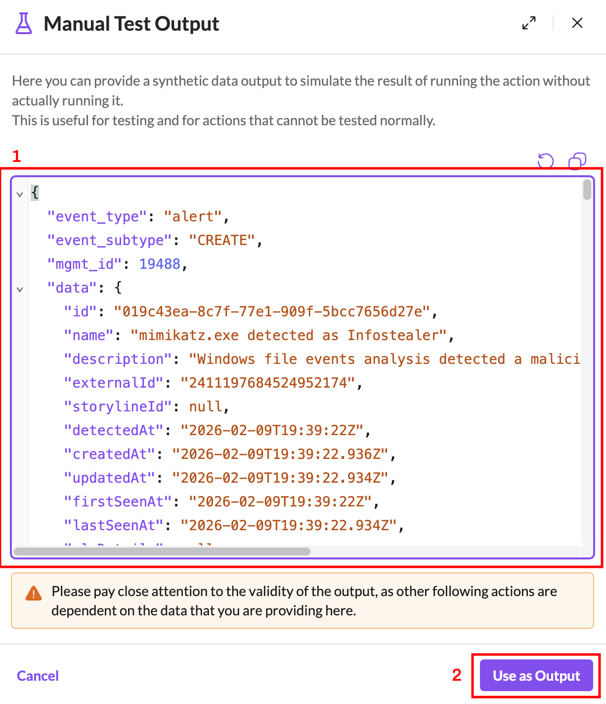

3. Back in the workflow, click on the **Configure required workflow variables** action (1) and then click the **Test Downstream Actions** button (2).
   
   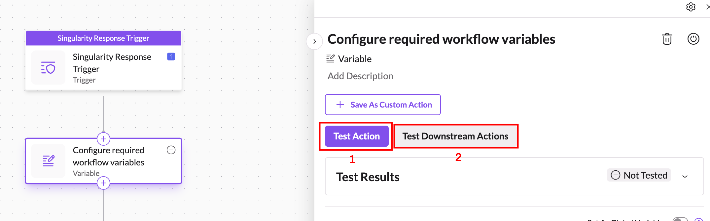

4. The workflow should run from there and you can test / troubleshoot as necessary.

## Troubleshooting the Workflow

The workflow periodically logs messages to SentinelOne AI SIEM during execution. To review the log messages simply click **Event Search** in the navigation menu (1). Use the following search criteria:

   - Select **All Data** from the dropdown (2) 
   - Enter `dataSource.category='Workflow' dataSource.name='LogEntry' dataSource.vendor='Okta'` for the search query (3).
   - Select an appropriate time range to search (4).
   - Click the **Search** button (5)
   
   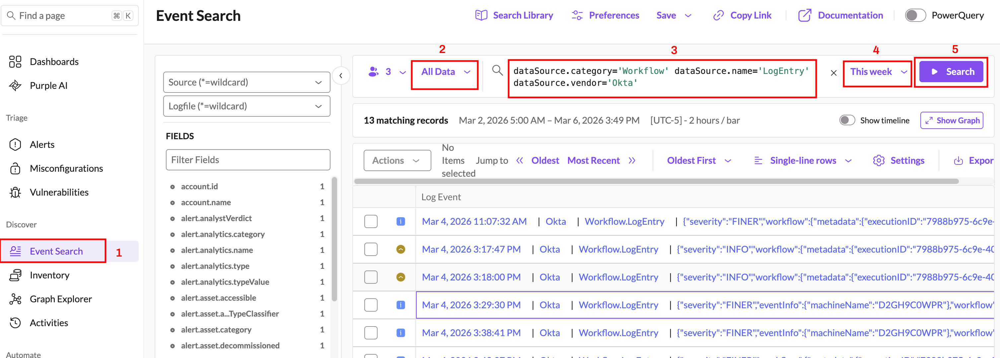

Simply review the log entries that are returned by clicking on any of them. Informational messages should show up with a medium severity level. Warnings should show up with a high severity level. Errors should show up with a critical severity level.

## Next Steps

- [Return to Main Page](../README.md)
