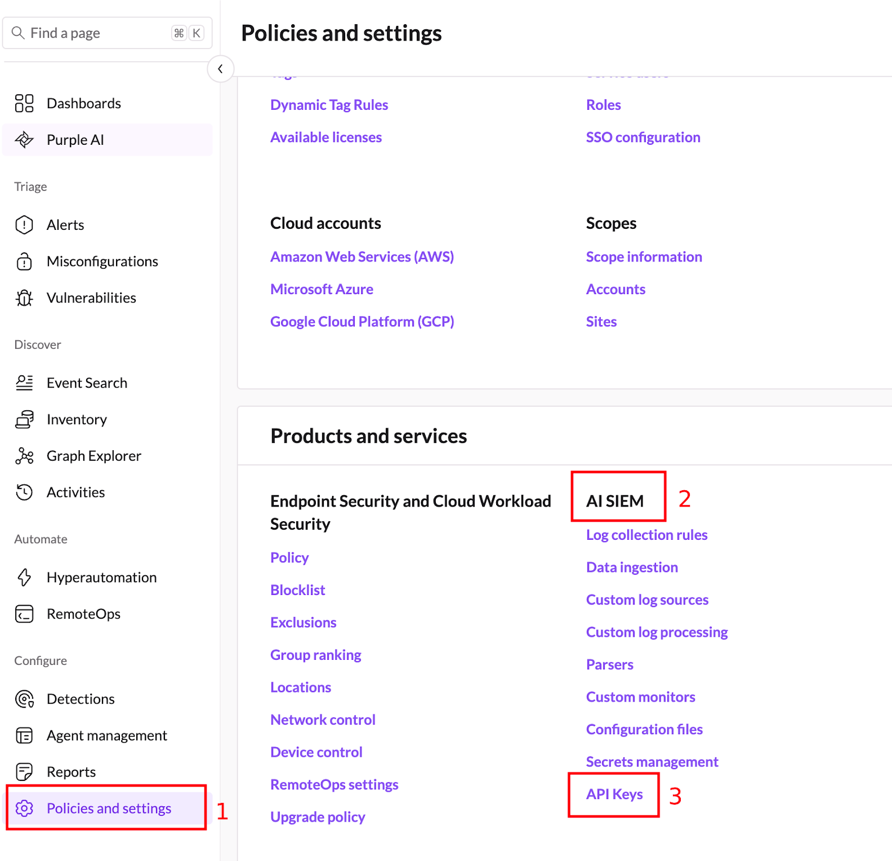
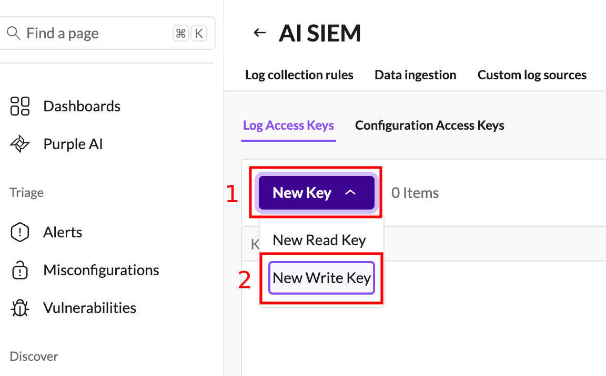
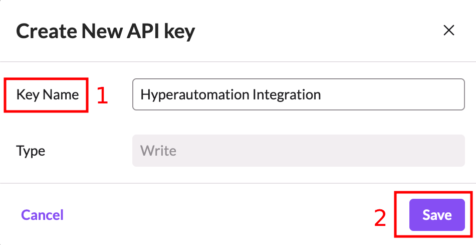
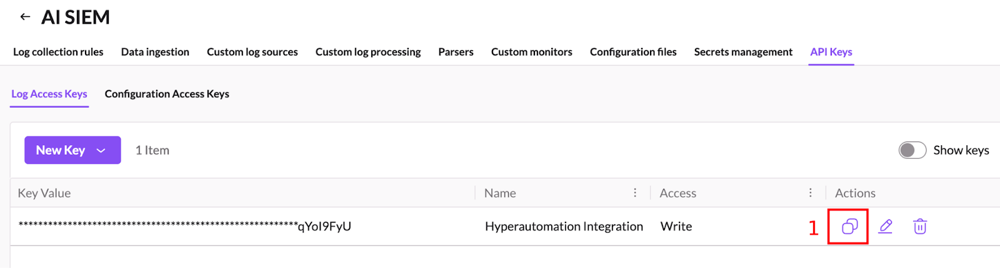
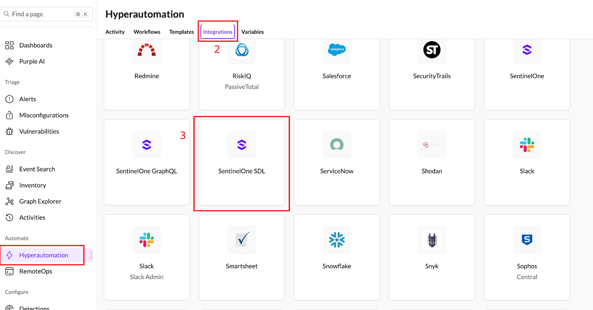
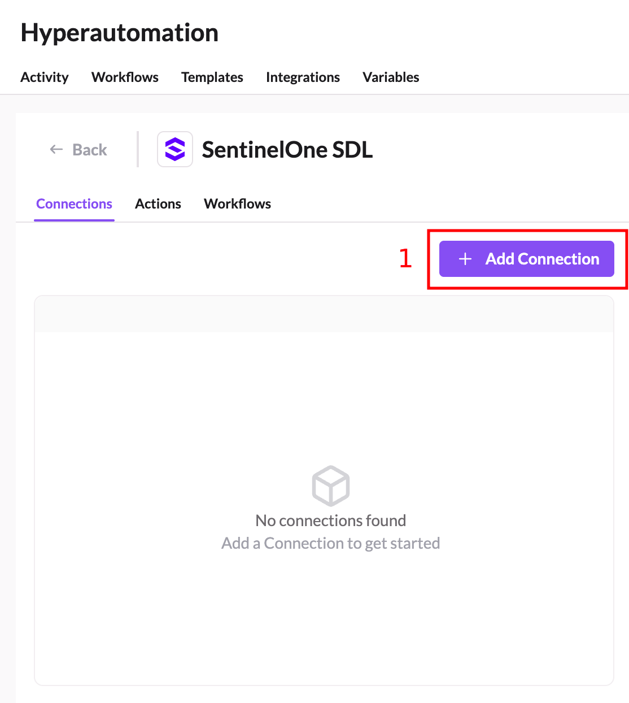
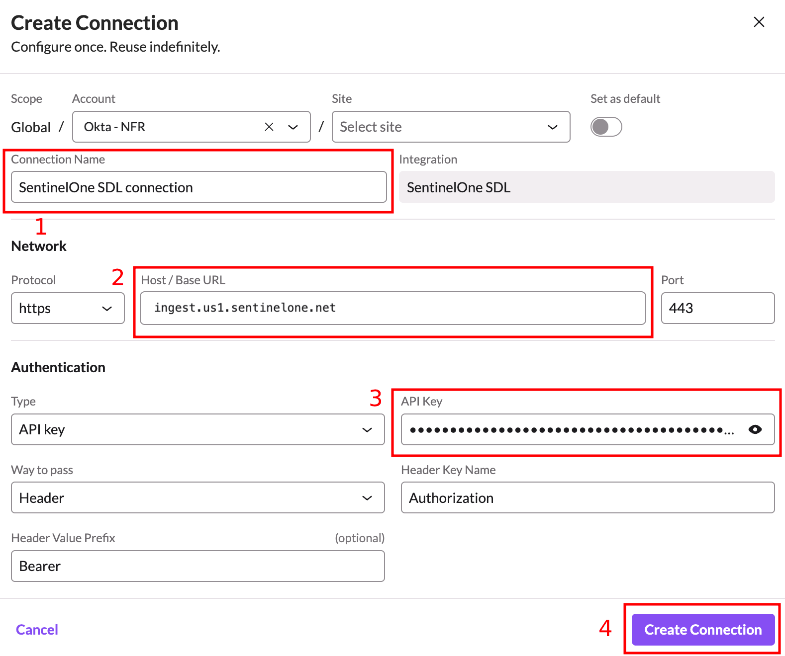

<!-- omit from toc -->
# Configuring Hyperautomation Integrations

Before getting started with these workflows, you’ll need to make sure you have a few integrations configured.  This document outlines how to configure the Hyperautomation integrations.

<!-- omit from toc -->
## Table of Contents

- [SentinelOne SDL (Required)](#sentinelone-sdl-required)
- [Okta (Required)](#okta-required)
- [Next Steps](#next-steps)

## SentinelOne SDL (Required)

The SentinelOne SDL integration is used by the workflow to send log messages that can be retrieved later for troubleshooting or for more easily reviewing what happened during a particular workflow execution.

To configure the integration:

1. In the SentinelOne console navigate to **Policies and Settings** (1) and then click **API Keys** (3) under **AI SIEM** (2).
   
   

2. On the **AI SIEM** page, click **New Key** (1) and then choose **New Write Key** (2).
   
   

3. Under **Key Name** (1) enter a name for the key such as `Hyperautomation Integration` and then click **Save** (2).
   
   

4. Back in the main **AI SIEM** screen, find the newly created key and copy it to the clipboard (1).
   
   

5. Now navigate to **Hyperautomation** (1) and click on **Integrations** (2) and then scroll to find the **SentinelOne SDL** integration (3) and click on it.
   
   

6. Click the **+ Add Connection** button (1).
   
   

7. Enter a **Connection Name** (1) and a **Host/Base URL** (2) from the table below using the closest region to your geographic location. Paste the API key you created in step 4 into the **API Key** (3) field and click **Create Connection** (4).

    | Region | Host / Base URL Value |
    |-|-|
    | US | ingest.us1.sentinelone.net |
    | Canada | ingest.ca1.sentinelone.net |
    | Germany | ingest.eu1.sentinelone.net |
    | India | ingest.ap1.sentinelone.net |
    | Australia | ingest.apse2.sentinelone.net |
      
   
    
8. Make a note of the **Connection Name** you used in the previous step.

## Okta (Required)

In order to use Okta to resolve usernames in alerts to actual email addresses from their Okta profile, you’ll need to configure this integration.  

Instructions for configuring this integration can be found on the SentinelOne Community portal here: 
https://community.sentinelone.com/s/article/000010846

Be sure to make a note of the **Connection Name** you use when configuring the integration.

## Next Steps

- [Configure SSF for Okta](./configure-okta-ssf.md)
- [Return to Main Page](../README.md)
