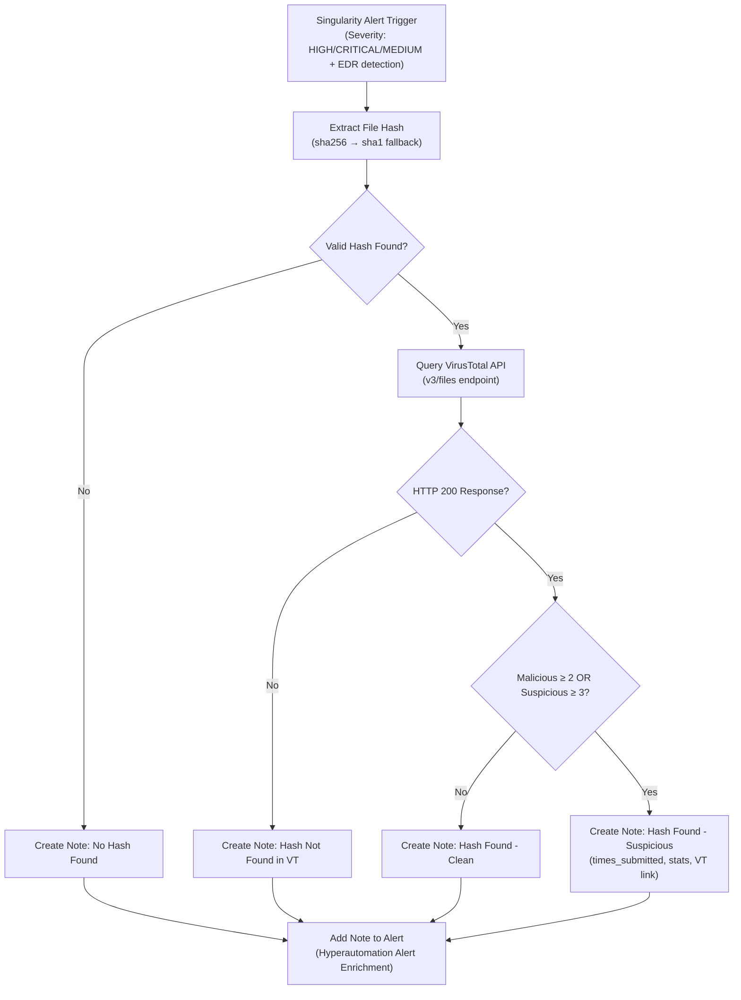

# VirusTotal Enrichment

**Vendor**: VirusTotal  
**Workflow ID**: virus-total-enrichment  
**Version**: v1.0  
**Category**: Threat Intel Enrichment / Hyperautomation

## Purpose

This workflow automatically enriches SentinelOne Singularity alerts with VirusTotal intelligence when a file hash (SHA256 or SHA1) is present. It checks the hash against VirusTotal, evaluates malicious/suspicious statistics, and adds a detailed note to the alert for faster analyst triage.

## Mermaid Workflow Diagram

## Use Case

 - Triggers: EDR alerts with HIGH, CRITICAL, or MEDIUM severity that contain a process file hash.
 - Value: Analysts receive immediate VirusTotal context directly in the Singularity alert note without leaving the console.
 - Hyperautomation Potential: Excellent building block for MCP/LLM-driven flows (e.g., dynamic containment decisions based on VT score).
 
## Dependencies

 - VirusTotal API connection (configured in SentinelOne)
 - SentinelOne Singularity API access (for adding notes to unified alerts)
 - Required permissions: Read access to alerts + ability to post GraphQL mutations
 
## Workflow Logic Summary

1. Trigger on qualifying EDR alerts
2. Extract the best available file hash
3. If no hash → add simple "no hash" note
4. Query VirusTotal v3 API
5. Based on response:
  - Hash not found
  - Hash found but clean
  - Hash found and suspicious/malicious
6. Add formatted note with details and direct VirusTotal link

## Implementation Details
See workflow.json for the complete executable definition.

## References
- [VirusTotal v3 Files API](https://developers.virustotal.com/reference/files)
- SentinelOne Unified Alert GraphQL API