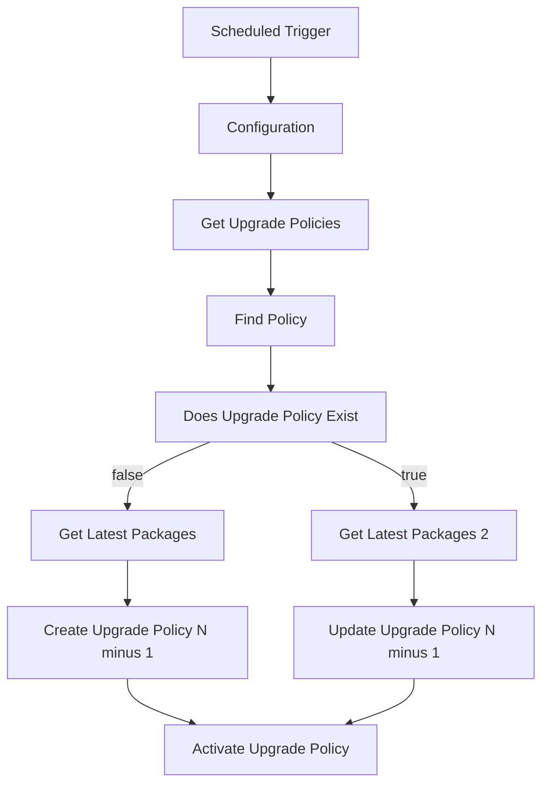

# n-1 Automatic Upgrade Policy

**Category**: Management / Hyperautomation  
**Trigger**: Daily scheduled (00:00 Los Angeles time)  
**Scope**: Configurable (Site / Account / Group)

## Overview

This workflow automatically maintains a SentinelOne **N-1 Windows Upgrade Policy** named  
`[Hyperautomation] N-1 Windows Upgrade Policy`.

It ensures the policy always references the **second-latest GA Windows agent package** (N-1), 
while the built-in "Latest" policy (or your N policy) can point to the current version.

This pattern is extremely useful for:
- Safe staged rollouts (pilot group → N-1 group → full fleet)
- Avoiding mass upgrades during major version jumps
- Maintaining compliance and minimizing disruption

## Workflow Logic (High-Level)

## Prerequisites

- Hyperautomation enabled in your SentinelOne Singularity console
- A configured SentinelOne Management Console connection with permissions to:
  - Read and write upgrade policies
  - Read agent packages
- Scope details prepared:
  - `scopeType`: `site`, `account`, or `group`
  - `scopeId`: Numeric ID of the target scope
  - `extension`: `.msi` (recommended) or `.exe`

## How to Deploy

1. In Singularity Hyperautomation → Workflows, import the JSON file.
2. Select or create your SentinelOne Management Console connection.
3. Edit the **Configuration** variable action and set your `scopeType`, `scopeId`, and `extension`.
4. Review the schedule (daily at 00:00 America/Los_Angeles) and enable the workflow.
5. Test by manually triggering the workflow.

## Notes & Customization

- The workflow is **native to SentinelOne Singularity** — it uses only the official Management Console APIs.
- It always selects the **second-latest GA Windows 64-bit package** as N-1.
- The update description includes a timestamp and package version for easy auditing in the console.
- Currently Windows-only. To support Linux or macOS, add a variable for `osType` and duplicate the package lookup steps.
- Error handling is basic (retries on HTTP 500). Consider adding a failure notification action for production use.
- Folder recommendation: Move to `workflows/community/sentinelone/management/[MGMT] N-1 Automatic Upgrade Policy/` for better organization.
- This is a pure Hyperautomation workflow (no AI-SIEM component).

**Status**: Ready for production use (community contribution)
