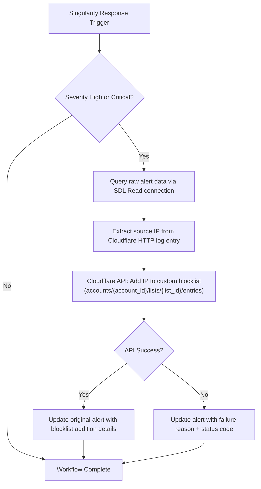

# Automated WAF Policy Enforcement based on Risk Score

**Version**: 1.0.0  
**Last Updated**: 2026-04-04

## Purpose
When SentinelOne AI SIEM detects sustained high-risk traffic from Cloudflare (risk_score < 25) matching a custom detection rule, this workflow automatically extracts the attacker IP and adds it to a Cloudflare custom blocklist. Pre-configured WAF rules then enforce the block at the edge.

## Trigger
- **Type**: Alert (Singularity Response Trigger)
- **Conditions**: 
  - Alert severity High or Critical
  - Custom detection rule matching Cloudflare HTTP Requests with risk_score < 25

## Integration Dependencies
- Cloudflare Lists API (requires account ID and list ID)
- SentinelOne SDL Read connection
- Cloudflare LogPush configured for HTTP Requests dataset

## Detailed Workflow Diagram (JSON-aligned)

## Execution Steps (Directly from JSON)
1. Receive alert via Singularity Response Trigger (filtered on High/Critical severity).
2. Query raw Cloudflare log data using SDL read connection.
3. Parse and extract the source IP from the HTTP request log.
4. Call Cloudflare Lists API to append the IP to the configured blocklist.
5. Update the original SentinelOne alert with success or failure information.
