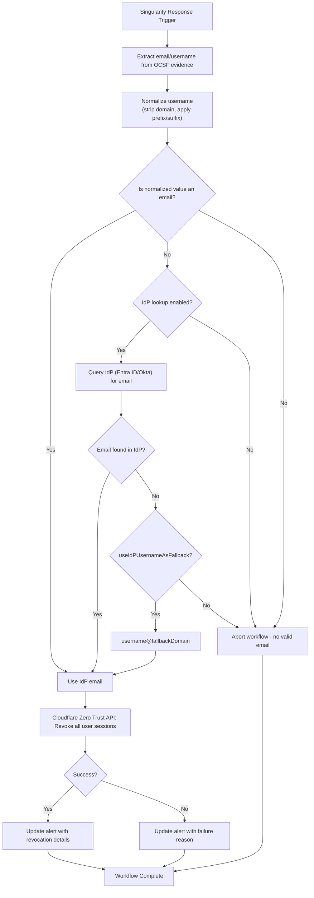

# Revoke Zero Trust Access on High IoC

**Version**: 1.0.0  
**Last Updated**: 2026-04-04

## Purpose
Rapidly revokes all active Cloudflare Zero Trust sessions (Access + WARP) for a user identified in a high-severity malware/ransomware/infostealer alert. This forces re-authentication across protected applications and limits attacker dwell time.

## Trigger
- **Type**: Alert (Singularity Response Trigger)
- **Conditions**: 
  - Alert classification: Ransomware, Malware, or Infostealer
  - Severity: High or Critical

## Integration Dependencies
- Cloudflare Zero Trust API (requires account ID)
- Optional IdP lookup: Microsoft Entra ID or Okta
- SentinelOne SDL Write connection (for audit notes)

## Execution Steps (Directly from JSON)
1. Trigger on High/Critical ransomware/malware/infostealer alert.
2. Extract email or username from OCSF evidence (with fallback to last logged-in user).
3. Normalize the identifier (strip domain, apply configured prefix/suffix).
4. If configured, perform IdP lookup (Entra ID or Okta) to resolve email.
5. Apply fallback logic if no email is found.
6. Call Cloudflare Zero Trust API to revoke all active sessions for the resolved email.
7. Update the original alert with success/failure and details.
